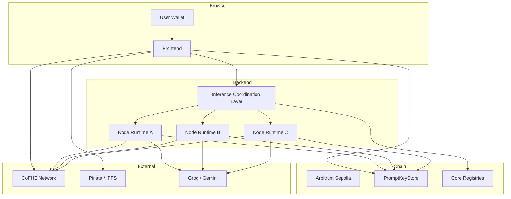
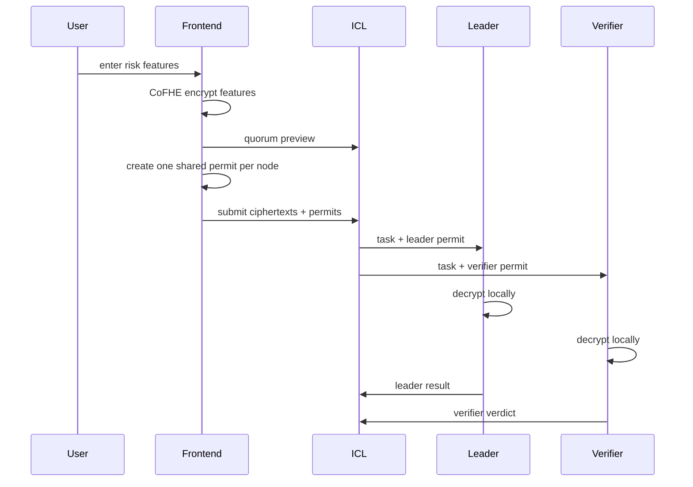
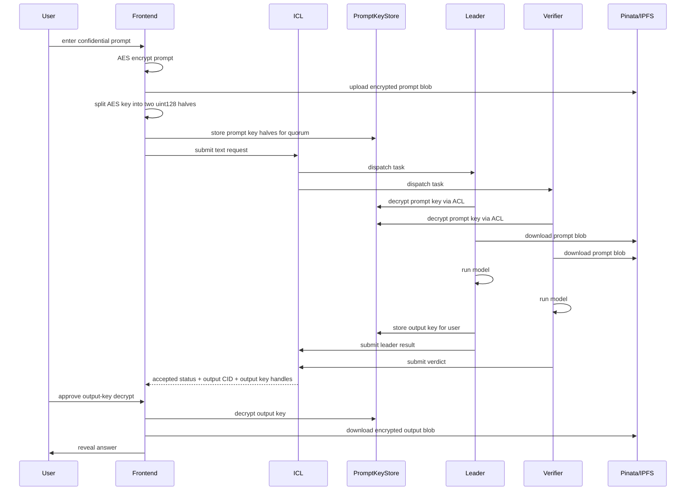
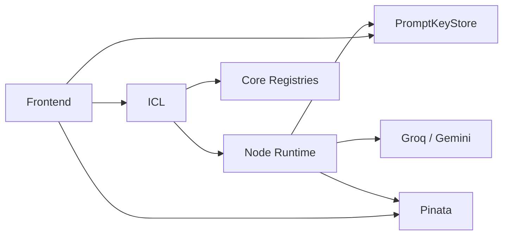

# Architecture

## Overview

Blindference Wave 3 is a confidential execution system with three properties:

- encrypted user inputs
- quorum-based off-chain execution
- on-chain visibility around who was allowed to act and how the result moved

This wave contains two related, but slightly different, privacy flows:

- risk scoring with browser CoFHE ciphertexts and per-node permit sharing
- text inference with AES-encrypted prompt/output blobs and on-chain prompt/output key storage in `PromptKeyStore`

## Top-Level View



## Main Components

### Frontend

Location: `wave2_network/packages/frontend`

Responsibilities:

- connect the user wallet
- perform browser-side encryption
- preview the selected quorum
- store prompt keys on-chain for text requests
- submit requests to the ICL
- poll request status
- decrypt the final output key for the user
- reveal the final answer or risk result

### ICL

Location: `wave2_network/packages/icl`

Responsibilities:

- accept requests
- choose quorum members
- persist request state
- dispatch tasks to leader and verifiers
- receive leader results and verifier verdicts
- aggregate quorum acceptance
- keep status visible to frontend and verifiers
- store/read metadata needed for on-chain coordination

### Node Runtime

Location: `wave2_network/packages/node-reineira`

Responsibilities:

- act as leader or verifier depending on assignment
- decrypt prompt keys through CoFHE ACL
- fetch encrypted prompt/output blobs from IPFS
- run Groq or Gemini text inference
- encrypt output AES key halves
- store the output key on-chain from the leader wallet
- submit result/vote back to the ICL

### Contracts

Locations:

- `wave2_network/packages/contracts`
- `wave2_network/packages/blindference-demo`

Core protocol layer:

- `NodeAttestationRegistry`
- `ExecutionCommitmentRegistry`
- `AgentConfigRegistry`
- `ReputationRegistry`
- `RewardAccumulator`
- `PromptKeyStore`

Demo vertical layer:

- `BlindferenceAgent`
- `BlindferenceInputVault`
- `BlindferenceAttestor`
- `BlindferenceUnderwriter`
- `MockPriceOracle`

## Two Distinct Privacy Models

### 1. Risk flow

Used for the original demo.



Properties:

- browser creates CoFHE ciphertexts directly
- user explicitly shares permits to nodes
- no prompt/output AES layer involved

### 2. Text flow

Added in this Wave 3 build.



Properties:

- prompt content itself is AES-encrypted
- prompt/output keys are protected with CoFHE
- quorum access is enforced through `PromptKeyStore` ACL
- final output remains user-only

## Why PromptKeyStore Exists

`PromptKeyStore` is the bridge between:

- browser/node-generated encrypted key halves
- assigned-reader ACL
- later `decryptForView(...)` calls

It solves two specific problems:

1. nodes need a safe, assigned-only way to decrypt prompt keys
2. the user needs a safe, user-only way to decrypt output keys

The important ownership rule is:

- the wallet that created the encrypted key inputs should also be the wallet that stores them on-chain

That is why the current architecture is:

- user wallet stores prompt key
- leader node wallet stores output key
- ICL reads stored handles back and distributes those handles, not the original ciphertext handles

## Handle Lifecycle

This detail matters because it caused real bugs during implementation.

```text
encryptInputs() in browser/node
  -> original ctHash values
  -> storeKey(...) in PromptKeyStore
  -> contract returns / preserves stored handles
  -> ACL is attached to those stored handles
  -> ICL must persist those stored handles
  -> nodes/frontend must decrypt those stored handles
```

If the system uses the original ciphertext handle instead of the stored on-chain handle, CoFHE decryption can fail with permission errors.

## Quorum Behavior

Default topology:

- `1 leader`
- `2 verifiers`

Behavior:

- leader produces the canonical result
- verifiers independently reproduce and compare
- ICL waits for enough confirmations
- accepted result becomes visible through status APIs and on-chain evidence

## Why The Final Wallet Signature Exists

Text flow has two separate decryption audiences:

- quorum nodes decrypt the prompt key
- the user decrypts the output key

So the final wallet interaction is not an accident. It is how the frontend proves the current wallet is allowed to unwrap the result key and view the answer.

## Storage Model

### Active

- Pinata for encrypted blobs
- Arbitrum Sepolia for contract state and recorded evidence
- in-memory local persistence by default for the ICL when Mongo is disabled

### No Longer The Active Path

- direct browser-to-Lighthouse upload
- OpenAI-specific text inference path
- `uint256` prompt/output key halves

## Deployment Boundaries



## Current Non-Final Pieces

These are not architecture gaps in the basic flow anymore, but they are still future work:

- `ResultRegistry.sol`
- `InferenceGate.sol`
- deeper Reineira escrow integration
- production policy / insurance integration
