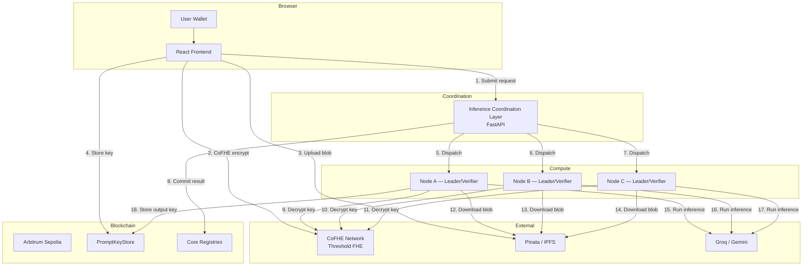
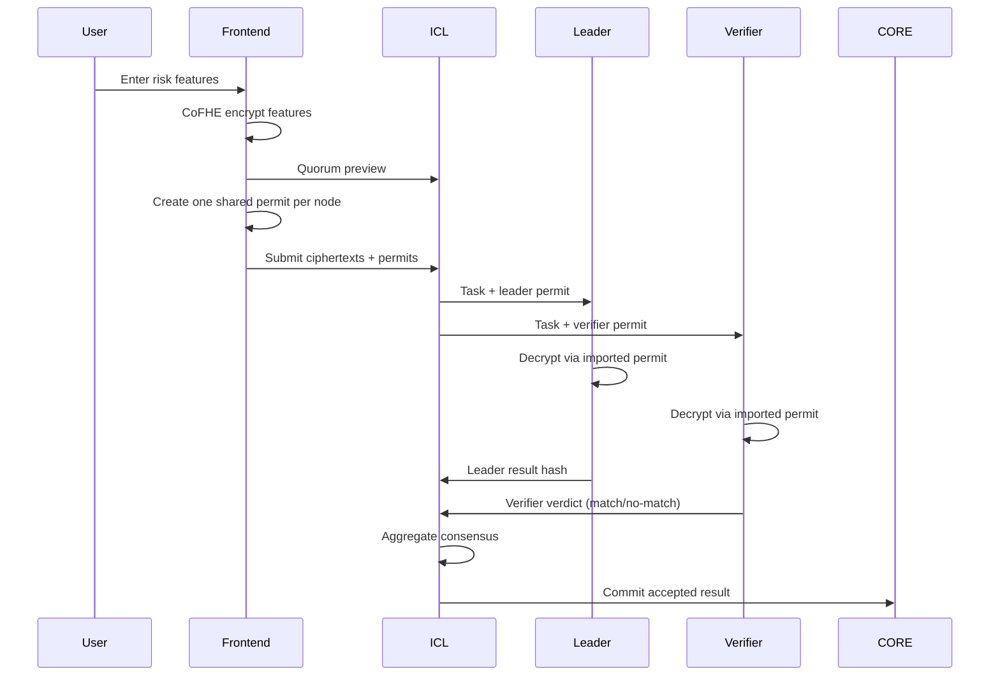
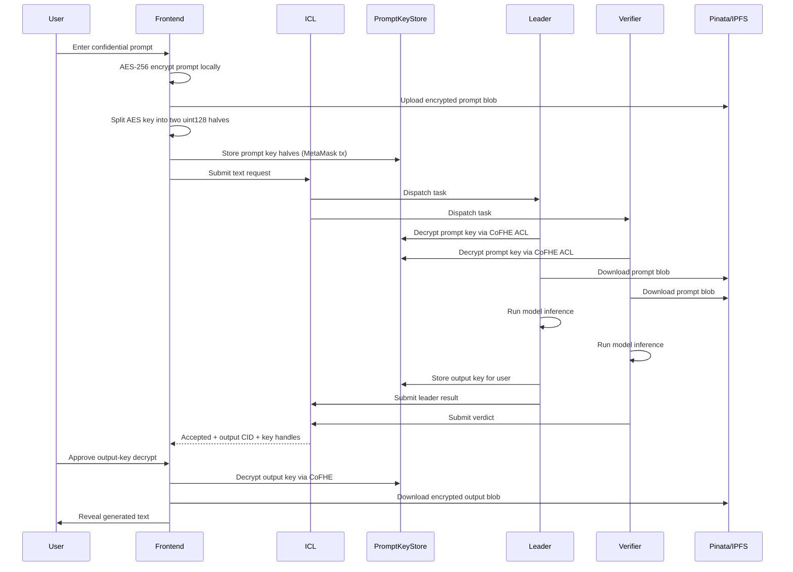
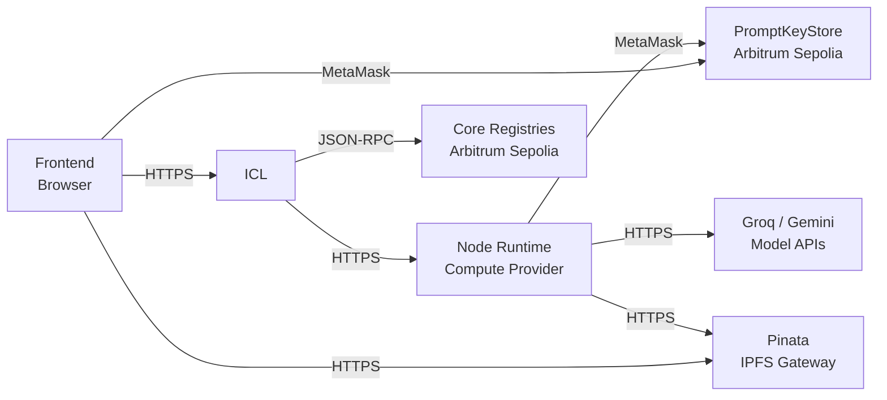

# Blindference Architecture

## Overview

Blindference is a confidential AI execution system with three core properties:

1. **Encrypted user inputs** — sensitive data never leaves the user's device in plaintext
2. **Quorum-based off-chain execution** — distributed inference with cryptographic verification
3. **On-chain accountability** — verifiable evidence of who acted and how results were produced

The system supports two privacy-preserving execution flows:

- **Risk scoring**: Browser CoFHE ciphertexts with per-node permit sharing
- **Text inference**: AES-encrypted prompt/output blobs with on-chain key storage via `PromptKeyStore`

## Top-Level System View



## Component Details

### Frontend (`network/packages/frontend`)

**Responsibilities:**

- **Wallet connection**: MetaMask via wagmi/viem on Arbitrum Sepolia
- **Browser encryption**: CoFHE for risk features, AES-256-GCM for text prompts
- **Quorum preview**: Calls ICL to see selected leader + verifiers before submitting
- **Key storage**: Stores prompt key halves in `PromptKeyStore` via MetaMask transaction
- **Request submission**: Submits encrypted inputs + sharing permits to ICL
- **Status polling**: Long-polls ICL for quorum progress and result status
- **Output decryption**: Decrypts output key from `PromptKeyStore` via CoFHE, downloads result blob from IPFS, reveals final answer

**Key files:**
- `src/pages/InferenceNewPage.tsx` — Main text inference UI
- `src/hooks/useCofheClient.ts` — CoFHE SDK initialization
- `src/utils/textPromptKey.ts` — AES key generation and CoFHE encryption
- `src/lib/tfhe-wrapper.ts` — TFHE WASM loading

### ICL — Inference Coordination Layer (`network/packages/icl`)

**Responsibilities:**

- **Request acceptance**: Validates encrypted inputs, model ID, coverage preferences
- **Quorum selection**: Selects 1 leader + N verifiers from active attested node pool
- **State persistence**: Stores request state in MongoDB Atlas (or in-memory for local dev)
- **Task dispatch**: Pushes tasks to node callback servers with role assignments
- **Result aggregation**: Collects leader results and verifier verdicts
- **Consensus logic**: 2/3 match = accepted, <2/3 = rejected, triggers on-chain commitment
- **Status APIs**: Provides frontend and node status endpoints
- **On-chain coordination**: Registers tasks, commits results, manages escrow

**Key files:**
- `main.py` — FastAPI app initialization
- `routers/inference.py` — REST endpoints for requests, uploads, commitments
- `routers/internal.py` — Node-facing endpoints (assignments, claims, heartbeats)
- `services/quorum_service.py` — Quorum selection, dispatch, aggregation
- `services/chain_service.py` — Web3 contract interactions
- `services/node_selector.py` — Active node ranking and selection

**Database collections:**
- `inference_requests` — Request state and metadata
- `quorum_assignments` — Leader/verifier mappings
- `operators` — Registered node operators with attestation data
- `verifier_verdicts` — Individual verifier submissions
- `permits` — CoFHE sharing permit records

### Node Runtime (`Blindference-node/` — standalone package)

**Responsibilities:**

- **Attestation**: Auto-re-attests with ICL on startup and watchdog (mock TEE for tier 0)
- **Heartbeat**: Sends liveness heartbeat to ICL every 60 seconds
- **Assignment polling**: Polls ICL for pending tasks every 5 seconds
- **Role execution**: Acts as leader or verifier depending on assignment
- **CoFHE decryption**: Decrypts prompt key halves via ACL permits
- **IPFS fetch**: Downloads encrypted prompt/output blobs
- **Model inference**: Runs Groq Llama 3 or Google Gemini via API
- **Result submission**: Submits leader results or verifier verdicts back to ICL

**Key files:**
- `blindference_node/cli.py` — CLI entry points (init, start, attest)
- `blindference_node/node_loop.py` — Daemon with heartbeat, watchdog, assignment poller
- `blindference_node/job_handler.py` — Task execution logic
- `blindference_node/crypto.py` — CoFHE client wrapper and AES blob handling
- `blindference_node/icl_client.py` — ICL REST API client

### Smart Contracts

#### Protocol Layer (`network/packages/contracts`)

Core Reineira-aligned registries deployed on Arbitrum Sepolia:

| Contract | Purpose |
|----------|---------|
| `NodeAttestationRegistry` | Stores operator attestations with tier and expiry |
| `ExecutionCommitmentRegistry` | Dispatches tasks, tracks commit/reveal deadlines |
| `ResultRegistry` | Records accepted/rejected inference outcomes |
| `ReputationRegistry` | Operator reputation scoring (tasks completed, slashed) |
| `AgentConfigRegistry` | Model ID to agent configuration mapping |
| `RewardAccumulator` | Reward distribution and claim management |
| `PromptKeyStore` | Stores CoFHE-encrypted AES key halves for text inference |

#### Demo Vertical (`network/packages/blindference-demo`)

Application-specific contracts:

| Contract | Purpose |
|----------|---------|
| `BlindferenceAgent` | Risk model agent configuration |
| `BlindferenceInputVault` | On-chain FHE input validation and ACL grant |
| `BlindferenceAttestor` | Custom attestation validation logic |
| `BlindferenceUnderwriter` | Insurance underwriter for coverage payouts |
| `MockPriceOracle` | Demo price feed for coverage calculations |
| `PayoutClaimer` | Reineira condition resolver for automatic settlements |

## Privacy Models

### 1. Risk Scoring Flow



**Properties:**
- Browser creates CoFHE ciphertexts directly via `@cofhe/sdk`
- User explicitly creates and shares permits to assigned quorum nodes
- No AES encryption layer — features remain as FHE ciphertexts throughout
- Result is a hash commitment, not a decrypted value

### 2. Text Inference Flow



**Properties:**
- Prompt content is AES-encrypted in browser before upload
- Prompt/output keys are protected with CoFHE threshold FHE
- Quorum access enforced through `PromptKeyStore` ACL (only assigned nodes can decrypt)
- Final output remains user-only — even the leader cannot read it without the user's wallet
- IPFS blobs are public but unreadable without the AES key

## Why PromptKeyStore Exists

`PromptKeyStore` is the critical bridge between:

- Browser/node-generated encrypted key halves
- Assigned-reader ACL enforcement
- `decryptForView(...)` threshold network calls

It solves two specific problems:

1. **Node access control**: Nodes need a safe, assigned-only way to decrypt prompt keys
2. **User exclusivity**: The user needs a user-only way to decrypt output keys

**Ownership rules:**
- User wallet stores prompt key (proves they created the encryption)
- Leader node wallet stores output key (proves they ran the inference)
- ICL reads stored handles back and distributes those handles, not original ciphertext handles

## Handle Lifecycle

This detail matters — using wrong handles causes real CoFHE permission errors.

```text
1. Browser calls encryptInputs() → original ctHash values
2. Browser calls storeKey() in PromptKeyStore
3. Contract returns/preserves stored handles
4. ACL is attached to stored handles (not original)
5. ICL persists stored handles in request metadata
6. Nodes/frontend decrypt stored handles via decryptForView
```

**Critical**: If the system uses the original ciphertext handle instead of the stored on-chain handle, CoFHE `sealOutput` will return HTTP 403 because the threshold network checks ACL on stored handles.

## Quorum Consensus

**Default topology:** 1 leader + 2 verifiers

**Behavior:**
- Leader produces the canonical result hash
- Verifiers independently reproduce inference and compare
- ICL waits for all verifier submissions
- 2/3 match (leader + 1 verifier) = **accepted**
- <2/3 match = **rejected**
- Accepted results committed on-chain via `ResultRegistry`
- Rejected results trigger dispute resolution (evidence submission, re-verification)

**Timeouts:**
- Execution commit window: 600 seconds
- Execution reveal window: 600 seconds
- Dispute deadline: 72 hours from request creation

## Storage Model

### Active Storage

| Layer | Technology | Purpose |
|-------|-----------|---------|
| Encrypted blobs | Pinata IPFS | Prompt/output ciphertext storage |
| Contract state | Arbitrum Sepolia | On-chain evidence and commitments |
| ICL persistence | MongoDB Atlas | Operator records, request state |
| Local dev fallback | In-memory dict | ICL state when Mongo unavailable |

### Deprecated Paths

- Direct browser-to-Lighthouse upload (replaced by Pinata)
- OpenAI-specific inference path (replaced by Groq/Gemini)
- `uint256` key halves (replaced by `uint128` halves for gas efficiency)

## Security Model

### Threat: Malicious Leader

**Mitigation**: Verifiers independently run the same inference. If leader result doesn't match, verifiers reject. <2/3 consensus = rejection, leader may be slashed.

### Threat: Compromised Node

**Mitigation**: Tiered attestation (mock/TPM/TEE). Nodes must re-attest periodically. Compromised nodes lose reputation and are excluded from quorum selection.

### Threat: ICL Compromise

**Mitigation**: ICL cannot decrypt anything — it only coordinates. Encryption keys are never sent to ICL. ACL enforcement happens in CoFHE threshold network, not ICL.

### Threat: Front-end XSS

**Mitigation**: All encryption happens in browser before DOM rendering. Keys are ephemeral (per-request). No long-lived secrets in localStorage.

## Deployment Boundaries



## Future Work

- Deeper Reineira escrow integration for automatic payouts
- Production insurance policy underwriting
- GPU-backed node tier (TPM/TEE attestation)
- Cross-chain result verification
- Decentralized ICL (multiple coordinator instances)
