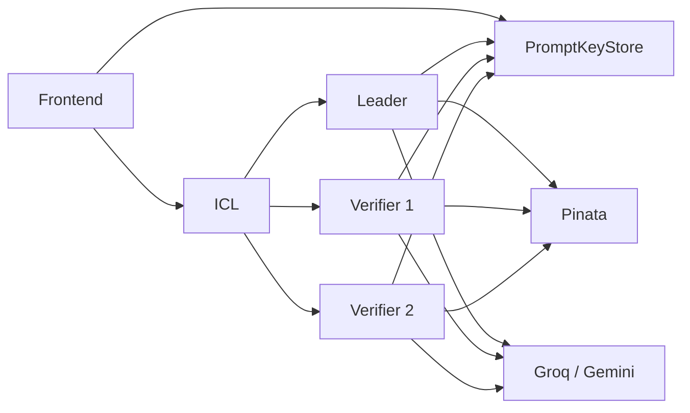

# Deployment

This document tracks the currently relevant Blindference Wave 3 deployments and local runtime expectations.

## Active Monorepo

The push-ready codebase is:

- `wave2_network/`

This folder name is historical. The current product/deployment story should be treated as Wave 3.

## Network Targets

### Chain

- Arbitrum Sepolia

### CoFHE

- current testnet RPC used by this stack: `https://api.helios.fhenix.zone`

### Blob Storage

- Pinata / IPFS

## Deployed Contracts

### Core protocol contracts

- `NodeAttestationRegistry`
  - `0xB54e019e9717a8Ed4746bA9d7F1A3F83cf0a35E0`
  - <https://sepolia.arbiscan.io/address/0xB54e019e9717a8Ed4746bA9d7F1A3F83cf0a35E0>
- `ExecutionCommitmentRegistry`
  - `0xcd45aefE9a16772528fa30B7d47958a95e83440C`
  - <https://sepolia.arbiscan.io/address/0xcd45aefE9a16772528fa30B7d47958a95e83440C>
- `AgentConfigRegistry`
  - `0x85aE035d6a94c006B5d0808cAdF47F5c22536996`
  - <https://sepolia.arbiscan.io/address/0x85aE035d6a94c006B5d0808cAdF47F5c22536996>
- `ReputationRegistry`
  - `0xdaDb4D46D231d3fe6D3754E0861c8bCD36aF0604`
  - <https://sepolia.arbiscan.io/address/0xdaDb4D46D231d3fe6D3754E0861c8bCD36aF0604>
- `RewardAccumulator`
  - `0xFa25Fb53eF8dAc88E4f43bB7558Cf3930Bf3e817`
  - <https://sepolia.arbiscan.io/address/0xFa25Fb53eF8dAc88E4f43bB7558Cf3930Bf3e817>

### PromptKeyStore

This is the critical new deployment for the text pipeline.

- contract:
  - `wave2_network/packages/contracts/contracts/core/PromptKeyStore.sol`
- current address:
  - `0x597ed3E3a442ebB31481AC3BAc98815F98ED6B44`
- explorer:
  - <https://sepolia.arbiscan.io/address/0x597ed3e3a442ebb31481ac3bac98815f98ed6b44>

Important:

- older deployment `0x3F883189F163950220993688E14A56F1474554E3` is obsolete for the current `uint128` handle flow

### Supporting core deployments

- `ArbiterSelectionRegistry`
  - `0xAaf7Dd729Cb5873975D3643bE2b89CA121143d3f`
- `MockAgentIdentityRegistry`
  - `0x723ef21650B66a5705eABB74c3f3a3dB1593bb62`
- `MockEscrowReleaser`
  - `0x6B1dC5aca048e0F5FF7fdd4831Bd721c5501b9fc`
- `PrevRandaoRandomness`
  - `0xA579Fb461FedA169d59481fE5A24Cb3B7beA8222`

### Demo contracts

- `BlindferenceInputVault`
  - `0x8dD7B2A9B69C76A69d33B2DF46426Cbe657a902b`
  - <https://sepolia.arbiscan.io/address/0x8dD7B2A9B69C76A69d33B2DF46426Cbe657a902b>
- `MockPriceOracle`
  - `0xDe9AE4b048bF320Db6492e2AfD0516392EBA05Fc`
  - <https://sepolia.arbiscan.io/address/0xDe9AE4b048bF320Db6492e2AfD0516392EBA05Fc>
- `BlindferenceAttestor`
  - `0x74454F689F28EfbEF6Ef9F3F14e56ac62CA8EC49`
  - <https://sepolia.arbiscan.io/address/0x74454F689F28EfbEF6Ef9F3F14e56ac62CA8EC49>
- `BlindferenceUnderwriter`
  - `0xcbbdcb1b42DE4Ed52f7ceD752c65652EE317B601`
  - <https://sepolia.arbiscan.io/address/0xcbbdcb1b42DE4Ed52f7ceD752c65652EE317B601>
- `BlindferenceAgent`
  - `0xc9208B8aCAaD3abFc955a575719BB8F21640A6fE`
  - <https://sepolia.arbiscan.io/address/0xc9208B8aCAaD3abFc955a575719BB8F21640A6fE>

## Deployment Story In This Wave

### Before

- protocol contracts existed
- risk flow contracts existed
- text flow contract code existed locally

### Added in this wave

- `PromptKeyStore` deployed and verified
- env propagation across:
  - `packages/contracts/.env`
  - `packages/icl/.env`
  - `packages/node-reineira/.env`
  - `packages/frontend/.env`

### Updated implementation assumptions

- key halves use `uint128`
- prompt key stored by user wallet
- output key stored by leader node wallet
- ICL reads back stored on-chain handles and persists those

## Runtime Topology



## Env Expectations

### Contracts

Needs deploy-only values:

- `PRIVATE_KEY`
- `ARB_SEPOLIA_RPC`
- `ARBISCAN_API_KEY`
- `PROMPT_KEY_STORE_ADDRESS`

### ICL

Needs:

- Arbitrum Sepolia RPC
- CoFHE RPC
- `PROMPT_KEY_STORE_ADDRESS`
- ICL private key
- demo operator keys
- `PINATA_JWT`

### Node runtime

Needs:

- ICL base URL
- provider selection (`groq` or `gemini`)
- provider API key
- CoFHE RPC
- `PROMPT_KEY_STORE_ADDRESS`
- one operator private key per node process
- `PINATA_JWT`

### Frontend

Needs:

- ICL base URL
- chain id
- prompt key store address
- walletconnect project id
- Pinata gateway URL

## Recommended Demo Bring-Up

```bash
bash wave2_network/scripts/demo/run-stack.sh
```

Status:

```bash
bash wave2_network/scripts/demo/status.sh
```

Stop:

```bash
bash wave2_network/scripts/demo/stop.sh
```

Logs:

```text
wave2_network/scripts/demo/logs/
```

## What A Successful Text Run Should Look Like

```text
1. frontend encrypts prompt
2. user wallet stores prompt key in PromptKeyStore
3. ICL creates and dispatches text request
4. leader + verifiers decrypt prompt key through ACL
5. leader and verifiers run Groq/Gemini
6. leader stores output key in PromptKeyStore for the user
7. ICL aggregates quorum
8. frontend decrypts output key and reveals answer
```

## Current Live Validation Note

The code now contains the latest fixes for:

- on-chain stored-handle persistence
- leader-owned output-key storage

So any final validation should always use a **fresh** text request after restart, not an older failed job.
