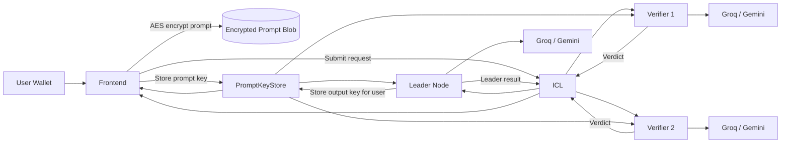

# Blindference

Blindference is a confidential AI execution layer for Web3. It coordinates encrypted requests across a `1 leader + 2 verifier` quorum, uses CoFHE for key access control, runs off-chain inference through hosted frontier models, and exposes the result lifecycle in a demoable on-chain flow on Arbitrum Sepolia.

## What It Does

Blindference enables users to submit sensitive prompts and data to AI models without revealing them to any single party. The system guarantees:

- **Input privacy**: User prompts are AES-256 encrypted in the browser before leaving the device
- **Access control**: Encryption keys are split into FHE-encrypted halves and stored on-chain via CoFHE, only decryptable by assigned quorum nodes
- **Execution integrity**: A `1 leader + 2 verifier` quorum runs identical inference and cross-validates results
- **Economic accountability**: Disputed results trigger on-chain verification with automatic USDC payouts via Reineira
   - **Staking & slashing**: Nodes stake BLIND tokens to participate; bad behavior is slashed
   - **Reward distribution**: Nodes earn BLIND rewards per verified job (60% leader, 20% each verifier)
   - **Output privacy**: Only the user can decrypt the final result using their wallet

## Supported Modes

- **Confidential text inference**: Submit natural language prompts to Groq Llama 3 or Google Gemini through encrypted channels
- **Confidential risk scoring**: Submit structured financial features for privacy-preserving credit/risk evaluation

## System Architecture



## Core Principles

- The coordinator (ICL) never sees plaintext
- Assigned quorum nodes only receive encrypted inputs with cryptographically enforced access control
- The user remains the only party who can reveal the final answer
- Execution is verifiable through quorum consensus and economically meaningful through on-chain settlement

## Monorepo Layout

```text
blindference/
├── README.md                 # This file
├── ARCHITECTURE.md           # Detailed component architecture
├── DEPLOYMENT.md            # Contract addresses and deployment guide
├── updates.md               # Changelog and release notes
├── CONTEXT.md               # LLM/engineer handoff context
├── network/                 # Main monorepo
│   ├── packages/
│   │   ├── contracts/       # Reineira protocol contracts
│   │   ├── blindference-demo/  # Demo vault/settlement contracts
│   │   ├── icl/             # FastAPI inference coordinator
│   │   ├── frontend/        # React/Vite browser client
│   │   ├── node-reineira/   # Node runtime (legacy, see Blindference-node)
│   │   ├── shared/          # Shared TypeScript utilities
│   │   └── shared-py/       # Shared Python utilities
│   └── scripts/demo/        # Demo stack orchestration scripts
└── Blindference-node/       # Standalone node runtime package
```

## Execution Flows

### Text Inference Flow

```text
1. User types prompt in browser
2. Browser AES-256 encrypts prompt locally
3. Encrypted blob uploaded to Pinata IPFS
4. AES key split into two uint128 halves
5. Each half CoFHE-encrypted and stored in PromptKeyStore contract
6. User submits request to ICL with quorum preview
7. ICL selects 1 leader + 2 verifiers from active node pool
8. ICL dispatches tasks to nodes with CoFHE sharing permits
9. Nodes decrypt prompt key halves via CoFHE ACL
10. Nodes download encrypted blob from IPFS
11. Nodes run identical inference via Groq/Gemini
12. Leader submits result hash + output key to ICL
13. Verifiers submit verdicts (match/no-match)
14. ICL aggregates: 2/3 match = accepted, <2/3 = rejected
15. Accepted result committed on-chain via ResultRegistry
16. Frontend polls status, decrypts output key, reveals answer
```

### Risk Scoring Flow

```text
1. User enters financial features in browser
2. Browser CoFHE-encrypts features
3. User creates sharing permits for each quorum node
4. Request submitted to ICL with encrypted features + permits
5. ICL dispatches to leader + verifiers
6. Nodes decrypt features via imported sharing permits
7. Nodes run risk model inference
8. Leader submits result hash, verifiers cross-validate
9. ICL commits accepted result on-chain
```

## CoFHE Prompt Key Storage Architecture

Fhenix CoFHE enforces that **only the address that created an encrypted input can call `FHE.asEuint128()`** with it. This means the ICL coordinator wallet cannot store prompt keys on behalf of the frontend user — the call will revert with `InvalidSigner(expectedSigner, actualSigner)`.

Three architectural options exist for handling this constraint. **Option A** is the current implementation.

### Option A: Frontend Calls `storeKey` (Two-Phase Flow) — IMPLEMENTED

**How it works:**
1. Frontend encrypts prompt key and calls `PromptKeyStore.storeKey(taskId, encHigh, encLow, allowedNodes)` directly via wagmi/viem
2. Frontend submits request to ICL, including `prompt_key_store_tx` hash in metadata
3. ICL verifies the tx (optional), calls `grantDecryptAccess(taskId, node)` for each quorum node, then dispatches

**Pros:**
- Proper on-chain storage with correct signer
- ACL access granted through contract
- Audit trail of who stored each key

**Cons:**
- Requires two-phase API (create → store → confirm)
- Frontend must wait for tx confirmation before dispatch
- Additional MetaMask popup for `storeKey`

**Implementation details:**
- ICL endpoint: `POST /v1/inference/{request_id}/confirm-store-key` with `{ prompt_key_store_tx: "0x..." }`
- ICL verifies key exists on-chain via `getEncryptedKey(taskId)` before dispatching
- If verification fails, ICL returns error and request stays in `pending_store_key` status

### Option B: Sharing Permits (No On-Chain Storage)

**How it works:**
1. Frontend creates CoFHE sharing permit for each quorum node (`client.permits.createSharing(issuer, recipient)`)
2. Frontend sends permits to ICL
3. ICL passes permits to nodes via assignment API
4. Nodes import permit (`client.permits.importShared(permit)`) and decrypt via `decryptForView().withPermit()`

**Pros:**
- No on-chain storage overhead
- No additional MetaMask popups
- Nodes decrypt directly with imported permits

**Cons:**
- No on-chain audit trail of prompt keys
- Permits must be created per-request, per-node
- If permit expires before node claims, decryption fails

**When to use:**
- Suitable for systems where on-chain key storage is not a hard requirement
- Lower latency, simpler flow
- Used by the legacy `blindference-old` implementation

### Option C: Hybrid — Frontend Store + ICL Grant

**How it works:**
1. Frontend calls `storeKey` with empty/miminal `allowedNodes`
2. ICL calls `grantDecryptAccess` for each assigned node
3. ICL dispatches after all nodes have access

**Pros:**
- Frontend pays storage gas once
- ICL dynamically grants access as nodes are assigned
- Flexible for changing quorum assignments

**Cons:**
- Still requires frontend `storeKey` call
- Slightly more complex contract interaction
- `grantDecryptAccess` must succeed for each node

**When to use:**
- When quorum assignments are dynamic or may change post-storage
- When you want the ICL to control node access after assignment

## Deployed Contracts (Arbitrum Sepolia)

| Contract | Address | Purpose |
|----------|---------|---------|
| PromptKeyStore | `0x1E22dD12f448B15f1Ca8560fB6B4463834FaAf73` | Stores CoFHE-encrypted AES key halves |
| NodeAttestationRegistry | `0xB54e019e9717a8Ed4746bA9d7F1A3F83cf0a35E0` | Operator attestation and tier verification |
| ExecutionCommitmentRegistry | `0xcd45aefE9a16772528fa30B7d47958a95e83440C` | Task dispatch and commitment tracking |
| ResultRegistry | `0xCebd831eCd00915E299b8Ef2666cAbf942dc7150` | On-chain result storage for settlement |
| ReputationRegistry | `0xdaDb4D46D231d3fe6D3754E0861c8bCD36aF0604` | Operator reputation scoring |
| AgentConfigRegistry | `0x85aE035d6a94c006B5d0808cAdF47F5c22536996` | Model and agent configuration |
| RewardAccumulator | `0xFa25Fb53eF8dAc88E4f43bB7558Cf3930Bf3e817` | Reward distribution |
| BlindferenceAttestor | `0x957CEb3F3E77bF91A001ef9FB2cEeB40A860FD79` | Custom attestation validation |
| BlindferenceUnderwriter | `0xC7D3706Ca2a42d739429Aec1b452051dA5Eb68f0` | Insurance underwriter |
| BlindferenceAgent | `0x43132afC4F163C244f7b66Adafee32F6B904994c` | Agent configuration |
| BLIND Token | `0x232D5470DaaC7AD552a42d876aDEF1f778033cE0` | ERC-20 utility token for staking, payments, and rewards |
| BlindferenceStaking | `0x222Ac74201Ed58915e42Ee5be626d939fd234D0b` | BLIND staking: stake/unbond/slash. Min 1000 BLIND, 96h unbond, auto-slash at 3 failures |
| BlindferencePolicyAdapter | `0xc8Ae5892bf5b91726FCb9B2a7EceDee596B795cF` | Mock insurance policy adapter (Tier 1 testnet) |
| BlindferenceUnderwriter | `0xC7D3706Ca2a42d739429Aec1b452051dA5Eb68f0` | Insurance underwriter |

See [DEPLOYMENT.md](./DEPLOYMENT.md) for full deployment details.

## Quick Start

### Prerequisites

- Node.js 18+ with npm/pnpm
- Python 3.11+ with uv/pip
- Foundry (for contract compilation)
- Git

### Running the Full Stack Locally

```bash
# 1. Start the ICL coordinator
cd network/packages/icl
./.venv/bin/uvicorn main:app --host 127.0.0.1 --port 9000

# 2. In another terminal, bootstrap demo operators
curl -s -X POST http://127.0.0.1:9000/admin/bootstrap-demo-nodes \
  -H 'Content-Type: application/json' \
  -d '{"count":3}'

   # 3. Start 3 nodes (in separate terminals)
   # See Blindference-node/ README for node setup

# 4. Start the Payment Service (rewards + credits)
cd network/packages/payment
./.venv/bin/uvicorn main:app --host 127.0.0.1 --port 8001

# 5. Start the frontend
cd network/packages/frontend
npm install
npm run dev
```

Or use the demo scripts:

```bash
bash network/scripts/demo/run-stack.sh   # Start everything
bash network/scripts/demo/status.sh        # Check status
bash network/scripts/demo/stop.sh        # Stop everything
```

Open http://localhost:3000 and connect MetaMask to Arbitrum Sepolia.

## Documentation

- [ARCHITECTURE.md](./ARCHITECTURE.md) — Component-level architecture and data flows
- [DEPLOYMENT.md](./DEPLOYMENT.md) — Contract deployment guide and addresses
- [updates.md](./updates.md) — Changelog and release history
- [CONTEXT.md](./CONTEXT.md) — Engineer/LLM handoff context

## Repositories

This project consists of two main repositories:

1. **blindference** (this repo) — Frontend, ICL coordinator, contracts, and demo infrastructure
2. **Blindference-node** — Standalone node runtime for compute providers

## License

MIT License — see [LICENSE](./LICENSE) for details.

## Contributing

We welcome contributions! Please see [CONTRIBUTING.md](./CONTRIBUTING.md) for guidelines.

## Contact

- Website: https://blindference.xyz
- Demo: https://blindference.vercel.app
- Twitter: @blindference
