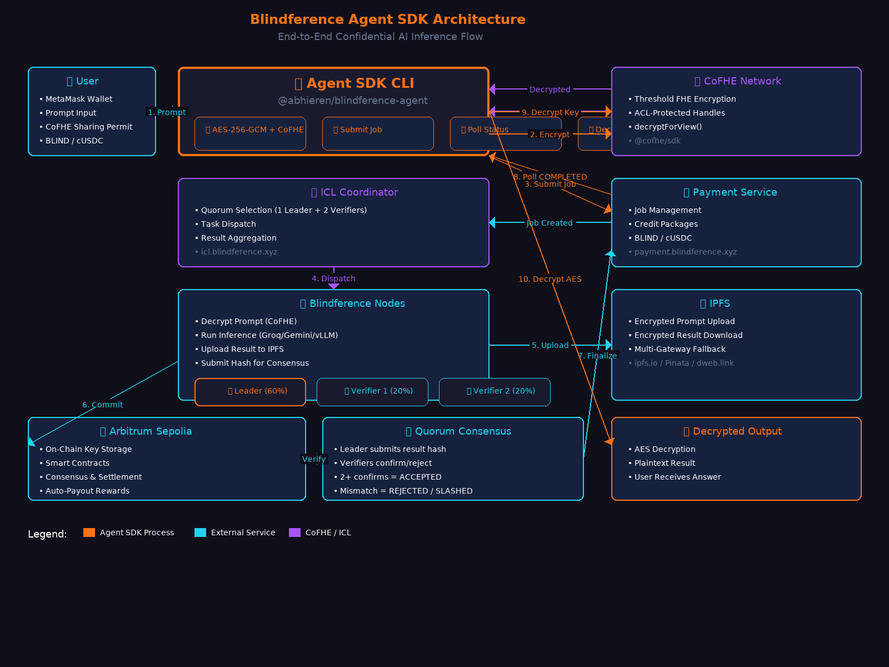

# Blindference — Confidential, Quorum-Verified AI Inference

> A decentralized private inference network where prompts are encrypted end-to-end, outputs are verified by a three-node quorum, and every job is economically settled on-chain. Live on Arbitrum Sepolia testnet.

[](./)
[](./LICENSE)
[](./)
[](./)
[](https://www.npmjs.com/package/@abhieren/blindference-agent)
[](https://pypi.org/project/blindference-node/)

---

## 🌊 Wave 5 Update — Live on Testnet

**Blindference is now fully operational on Arbitrum Sepolia.** This represents our fifth major wave of development, bringing together end-to-end encryption, quorum consensus, on-chain settlement, and builder tooling into a single coherent system.

See [UPDATES.md](./UPDATES.md) for the complete Wave 5 changelog, or read the highlights below:

- **Text inference live** — Browser AES-256-GCM encrypts prompts; CoFHE gates keys via `BlindferenceInputVault`; IPFS blob; 1 leader + 2 verifiers run identical models (Groq Llama 3.3 70B / Gemini 2.5 Flash); ≥2/3 hash match commits on-chain; only the caller wallet decrypts. Verified with real MetaMask wallets.
- **Payments live** — cUSDC/BLIND credit balances or Reineira escrows. Auto-release on `ACCEPTED`, auto-refund on rejection. 2% insurance premium. Node rewards split 60/20/20.
- **Reineira settlement** — `PayoutClaimer` + `InferenceGate` implement `IConditionResolver`. `BlindferenceInference` enforces quorum before payout. `BlindferenceUnderwriter` handles disputes. Auto-verify, auto-payout, auto-refund all on testnet.
- **Builder packages** — `blindference-node` on PyPI: one-command `init` → `run` with CoFHE bridge. `@abhieren/blindference-agent` on npm: CLI (`infer`, `balance`, `buy-package`), TypeScript SDK (`createJob`, `pollUntilTerminal`), and REST server for language-agnostic integration.
- **YouTube** — [https://www.youtube.com/@Blindference](https://www.youtube.com/@Blindference)
- **Docs live** — Beautiful and detailed at `/docs`: node setup, SDK quickstart, CLI reference, Python interop, troubleshooting.

---

## What is Blindference?

AI inference today exposes your prompts to model providers, offers no proof that the output came from the claimed model, and provides no recourse if a node returns garbage. Blindference fixes all three.

**The problem:**
- **No input privacy** — Your prompts, financial data, and personal information are visible to whoever runs the model.
- **No output verifiability** — You have to trust that the provider ran the exact model they claim to have run.
- **No financial accountability** — If a node fails or cheats, you bear the cost.

**Blindference solves this with:**
- **AES-256-GCM encryption** in the browser before your prompt ever leaves your device.
- **Fhenix CoFHE** access control so only the assigned quorum nodes can decrypt your key.
- **A 2/3 quorum** of independent nodes that run the same inference and cross-validate results.
- **Reineira escrows** that hold payment until the quorum agrees, then distribute rewards automatically.

In short: **No party — not the node operators, not the coordinator, not the blockchain — ever sees your prompt or answer in plaintext.** Only your wallet can decrypt the final result.

---

## Architecture



> *See [docs/assets/architecture.excalidraw](docs/assets/architecture.excalidraw) for the editable source.*

### Data Flow

```
┌─────────────────┐     ┌──────────────┐     ┌─────────────┐     ┌──────────────┐
│   User Wallet   │────▶│   Frontend   │────▶│    IPFS     │     │   ICL API    │
│  (MetaMask)     │     │  AES-256-GCM │     │ Encrypted   │     │  Coordinator │
└─────────────────┘     │   Encrypt    │     │   Blob      │     └──────┬───────┘
                        └──────────────┘     └─────────────┘            │
                               │                                          │
                               ▼                                          ▼
                        ┌──────────────┐                           ┌──────────────┐
                        │PromptKeyStore│                           │   Quorum     │
                        │ CoFHE ACL    │                           │  Assignment  │
                        │ Key Halves   │                           │ 1 Leader +   │
                        └──────────────┘                           │ 2 Verifiers  │
                                                                   └──────┬───────┘
                                                                          │
                                                                          ▼
                        ┌──────────────────────────────────────────────────┐
                        │              Quorum Nodes (3)                      │
                        │  ┌─────────────┐  ┌─────────────┐  ┌───────────┐│
                        │  │   Leader    │  │  Verifier 1 │  │Verifier 2 ││
                        │  │ Groq/Gemini │  │ Replay Hash │  │Replay Hash││
                        │  │ + IPFS fetch│  │ + IPFS fetch│  │+ IPFS fetch│
                        │  └──────┬──────┘  └──────┬──────┘  └─────┬─────┘│
                        └─────────┼────────────────┼───────────────┼──────┘
                                  │                │               │
                                  ▼                ▼               ▼
                        ┌──────────────────────────────────────────────────┐
                        │              On-Chain Settlement                   │
                        │  ResultRegistry → ≥2/3 match → ACCEPTED          │
                        │  PayoutClaimer → release escrow → node rewards   │
                        │  Reineira IConditionResolver → auto-payout       │
                        └──────────────────────────────────────────────────┘
```

### Components

| Layer | Component | Role |
|-------|-----------|------|
| **Client** | Browser Frontend | AES encrypts prompt, CoFHE splits key, submits job |
| **Client** | Agent SDK (`@abhieren/blindference-agent`) | CLI + TypeScript SDK for programmatic use |
| **Storage** | IPFS (Pinata) | Encrypted prompt blob + encrypted result blob |
| **Coordination** | ICL API (`icl.blindference.xyz`) | Quorum selection, dispatch, consensus, on-chain writes |
| **Payment** | Payment Service (`payment.blindference.xyz`) | Credit balances, escrow creation, reward distribution |
| **Compute** | Node Runtime (`blindference-node`) | Decrypts via CoFHE, runs inference, submits hashes |
| **Chain** | Arbitrum Sepolia | Smart contracts for settlement, staking, attestation |

---

## Quick Start

### Path 1: Web App (Fastest)

1. Visit [https://www.blindference.xyz](https://www.blindference.xyz)
2. Connect MetaMask (Arbitrum Sepolia)
3. Get test ETH + BLIND tokens from the [faucet](https://www.blindference.xyz/faucet)
4. Buy credits or create an escrow
5. Type a prompt → submit → wait 60-120s → decrypt result locally

### Path 2: Agent SDK (Programmatic)

```bash
# Install
npm install -g @abhieren/blindference-agent

# Set environment
export BLF_PRIVATE_KEY=0xYOUR_KEY
export BLF_RPC_URL=https://arb-sepolia.g.alchemy.com/v2/YOUR_KEY
export BLF_PAYMENT_URL=https://payment.blindference.xyz
export BLF_ICL_URL=https://icl.blindference.xyz

# Run inference
blindference-agent infer --prompt "What is the capital of France?"
```

See the [Agent SDK repo](https://github.com/AbhishekPanwarr/Blindference-Agent) for full documentation.

### Path 3: Run a Node (Earn Rewards)

```bash
# Install
pip install blindference-node

# Initialize
blindference-node init

# Configure .env with your operator address and ICL URL
# Run
blindference-node run
```

See the [Node repo](https://github.com/AbhishekPanwarr/Blindference-node) for setup details.

---

## Deployed Contracts (Arbitrum Sepolia)

| Contract | Address | Purpose |
|----------|---------|---------|
| `PromptKeyStore` | `0x1E22dD12f448B15f1Ca8560fB6B4463834FaAf73` | Stores CoFHE-encrypted AES key halves with ACL |
| `ResultRegistry` | `0xCebd831eCd00915E299b8Ef2666cAbf942dc7150` | On-chain result commitments |
| `BlindferenceInference` (proxy) | `0x98b08590D1CB28E6687eFea59A32BE8B16571C86` | On-chain inference job creation |
| `BlindferenceInferenceGate` | `0x6a3fA63542d0b69937949372c11348A9EE3f6459` | Escrow unlock condition resolver |
| `PayoutClaimer` v3 | `0xA27b6C2b21E09F703b4be3ce70E7433B1F4210B3` | Simplified escrow redemption |
| `BlindferenceInputVault` | `0x8dD7B2A9B69C76A69d33B2DF46426Cbe657a902b` | FHE input validation |
| `BlindferenceUnderwriter` | `0xC7D3706Ca2a42d739429Aec1b452051dA5Eb68f0` | Insurance underwriter |
| `NodeAttestationRegistry` | `0xB54e019e9717a8Ed4746bA9d7F1A3F83cf0a35E0` | Operator attestation |
| `ReputationRegistry` | `0xdaDb4D46D231d3fe6D3754E0861c8bCD36aF0604` | Operator scoring |
| `RewardAccumulator` | `0xFa25Fb53eF8dAc88E4f43bB7558Cf3930Bf3e817` | Reward distribution |
| `BLIND Token` | `0x232D5470DaaC7AD552a42d876aDEF1f778033cE0` | Network token |
| `Reineira cUSDC` | `0x42E47f9bA89712C317f60A72C81A610A2b68c48a` | Stablecoin for payments |
| `Reineira Escrow` | `0xbe1eEB78504B71beEE1b33D3E3D367A2F9a549A6` | Escrow factory |

---

## Repository Structure

```
blindference/
├── network/
│   ├── packages/
│   │   ├── frontend/          # React 19 + Vite web app
│   │   ├── icl/               # Inference Coordination Layer (FastAPI)
│   │   ├── payment/           # Payment Service (FastAPI + MongoDB)
│   │   ├── node-reineira/     # Node runtime (Python)
│   │   └── shared-py/         # Shared Python utilities
│   └── contracts/             # Solidity smart contracts
├── docs/
│   └── assets/               # Architecture diagrams
├── README.md                  # This file
├── UPDATES.md                 # Wave-by-wave changelog
└── TECHNICAL_OVERVIEW.md      # Deep technical specification
```

---

## Documentation

- **Live docs**: [https://www.blindference.xyz/docs](https://www.blindference.xyz/docs)
- **Agent SDK docs**: [https://github.com/AbhishekPanwarr/Blindference-Agent](https://github.com/AbhishekPanwarr/Blindference-Agent)
- **Node docs**: [https://github.com/AbhishekPanwarr/Blindference-node](https://github.com/AbhishekPanwarr/Blindference-node)
- **YouTube**: [https://www.youtube.com/@Blindference](https://www.youtube.com/@Blindference)

---

## License

MIT — see [LICENSE](./LICENSE)

**Support**: Telegram [@abhieren](https://t.me/abhieren)  
**GitHub**: [AbhishekPanwarr/Blindference](https://github.com/AbhishekPanwarr/Blindference)
