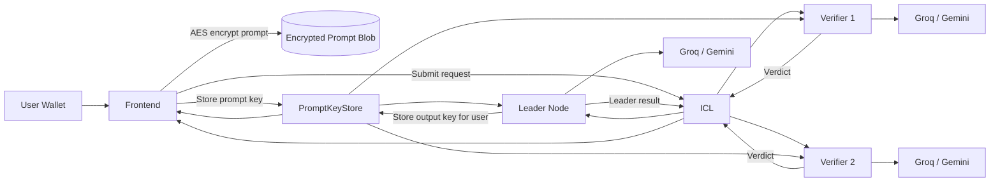
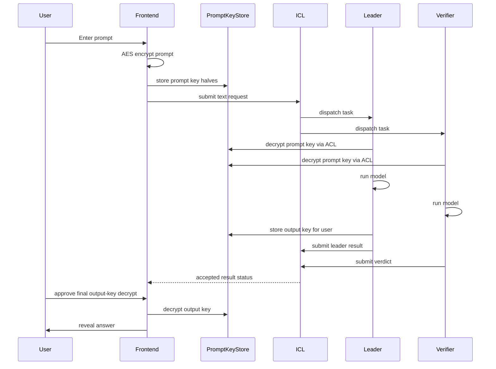

# Blindference Wave 3

Blindference Wave 3 is a confidential AI execution layer for Web3. It coordinates encrypted requests across a `1 leader + 2 verifier` quorum, uses CoFHE for key access control, runs off-chain inference through hosted frontier models, and exposes the result lifecycle in a demoable on-chain flow on Arbitrum Sepolia.

This wave now supports two user-facing modes:

- confidential risk scoring
- confidential text inference

## What Changed In This Wave

The biggest update is the new confidential text pipeline. It is a complete end-to-end flow that allows users to encrypt a text prompt, submit it to the network, have it processed by a quorum of nodes, and then decrypt the answer using their wallet.

### Added

- browser-side text prompt encryption with AES-256
- Pinata/IPFS storage for encrypted prompt/output blobs
- `PromptKeyStore` contract for CoFHE-encrypted AES key halves
- node-side prompt-key decryption for assigned quorum members
- frontend text submission UI
- Groq / Gemini model selection in text mode
- frontend output-key decryption and answer reveal
- background demo stack scripts

### Updated

- CoFHE SDK flow aligned to `@cofhe/sdk@0.5.1`
- key halves use `uint128` instead of the older `uint256` assumption
- prompt keys are stored by the user wallet
- output keys are stored by the leader node wallet
- ICL now persists the on-chain stored handles instead of the original ciphertext handles

## System Picture



## Why This Matters

Blindference is trying to make private AI execution feel complete, not partial.

That means:

- the coordinator should not need plaintext
- the assigned nodes should not need global access
- the user should remain the only one who can reveal the final answer
- the execution should still be verifiable and economically meaningful

## Current Architecture

Blindference Wave 3 has five main layers:

1. `packages/frontend`
   - wallet UX, encryption, submission, polling, result reveal
2. `packages/icl`
   - coordination, quorum assignment, dispatch, aggregation, status APIs
3. `packages/node-reineira`
   - leader/verifier runtime, CoFHE bridge, Groq/Gemini execution
4. `packages/contracts`
   - protocol contracts and `PromptKeyStore`
5. `packages/blindference-demo`
   - demo-specific vault/settlement contracts still used by the UI shell

## Monorepo Layout

```text
blindference/
├── README.md
├── ARCHITECTURE.md
├── DEPLOYMENT.md
├── BLINDFERENCE_CONTEXT_TRANSFER.md
└── wave2_network/
    ├── packages/contracts/
    ├── packages/blindference-demo/
    ├── packages/icl/
    ├── packages/frontend/
    ├── packages/node-reineira/
    ├── packages/shared/
    ├── packages/shared-py/
    └── scripts/demo/
```

## Wave 3 Execution Flows

### Risk flow

```text
User features -> browser CoFHE encryption -> ICL -> leader/verifier quorum
-> hosted inference/verification -> accepted result -> on-chain commitment
```

### Text flow

```text
Prompt text -> browser AES encryption -> encrypted blob upload
-> prompt key split into uint128 halves
-> prompt key halves CoFHE-encrypted and stored in PromptKeyStore
-> quorum decrypts prompt key under ACL
-> hosted inference -> leader stores output key for user
-> frontend decrypts output key -> answer revealed
```

## Deployed Text-Key Contract

Current `PromptKeyStore` deployment:

- address: `0x597ed3E3a442ebB31481AC3BAc98815F98ED6B44`
- explorer: <https://sepolia.arbiscan.io/address/0x597ed3e3a442ebb31481ac3bac98815f98ed6b44>

## Quick Start

Use the demo scripts:

```bash
bash wave2_network/scripts/demo/run-stack.sh
```

Check status:

```bash
bash wave2_network/scripts/demo/status.sh
```

Stop everything:

```bash
bash wave2_network/scripts/demo/stop.sh
```

Frontend:

- `http://127.0.0.1:3000`

ICL:

- `http://127.0.0.1:8000`

## Demo Visuals

### Text flow sequence



## Important Runtime Notes

- text mode does not need a user-shared node permit prompt anymore
- the final wallet interaction is expected, because the output key is encrypted for the user
- old text jobs created before the latest handle-persistence fixes may still fail; use a fresh request for validation

## Related Docs

- [Architecture](./ARCHITECTURE.md)
- [Deployment](./DEPLOYMENT.md)
- [Context Transfer](./BLINDFERENCE_CONTEXT_TRANSFER.md)
- [Wave 3 Monorepo Notes](./wave2_network/README.md)

## Naming Note

The implementation still lives under `wave2_network/` because that is the existing monorepo path, but the current build and docs should be treated as the Wave 3 build.
