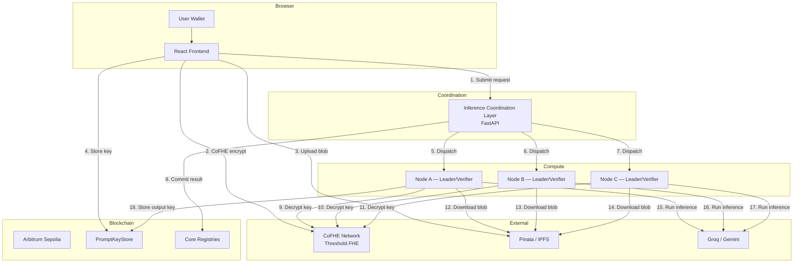

# Architecture

## Overview

Blindference is a confidential AI execution system with three core properties:

1. **Encrypted user inputs** — sensitive data never leaves the user's device in plaintext
2. **Quorum-based off-chain execution** — distributed inference with cryptographic verification
3. **On-chain accountability** — verifiable evidence of who acted and how results were produced

## System Diagram

## Component Details

<Accordion title="Frontend (network/packages/frontend)">
  **Responsibilities:**

  - Wallet connection via MetaMask + wagmi/viem on Arbitrum Sepolia
  - Browser encryption: CoFHE for risk features, AES-256-GCM for text prompts
  - Quorum preview: calls ICL to see selected leader + verifiers before submitting
  - Key storage: stores prompt key halves in `PromptKeyStore` via MetaMask transaction
  - Request submission: submits encrypted inputs + sharing permits to ICL
  - Status polling: long-polls ICL for quorum progress and result status
  - Output decryption: decrypts output key from `PromptKeyStore`, downloads result blob from IPFS, reveals final answer

  **Tech stack:** React 19 + TypeScript, Vite 6, wagmi + viem, @cofhe/sdk, TailwindCSS + shadcn/ui, Framer Motion
</Accordion>

<Accordion title="ICL — Inference Coordination Layer (network/packages/icl)">
  **Responsibilities:**

  - Accept requests: validates encrypted inputs, model ID, coverage preferences
  - Select quorum: chooses 1 leader + N verifiers from active attested node pool
  - Persist state: stores request state in MongoDB Atlas (or in-memory for local dev)
  - Dispatch tasks: pushes tasks to node callback servers with role assignments
  - Aggregate results: collects leader results and verifier verdicts
  - Consensus logic: 2/3 match = accepted, <2/3 = rejected, triggers on-chain commitment
  - Status APIs: provides frontend and node status endpoints
  - On-chain coordination: registers tasks, commits results, manages escrow

  **Tech stack:** Python 3.11+, FastAPI, Pydantic, Motor (async MongoDB), Web3.py
</Accordion>

<Accordion title="Node Runtime (Blindference-node/ — standalone package)">
  **Responsibilities:**

  - Attestation: auto-re-attests with ICL on startup and watchdog (mock TEE for tier 0)
  - Heartbeat: sends liveness heartbeat to ICL every 60 seconds
  - Assignment polling: polls ICL for pending tasks every 5 seconds
  - Role execution: acts as leader or verifier depending on assignment
  - CoFHE decryption: decrypts prompt key halves via ACL permits
  - IPFS fetch: downloads encrypted prompt/output blobs
  - Model inference: runs Groq Llama 3 or Google Gemini via API
  - Result submission: submits leader results or verifier verdicts back to ICL

  **Tech stack:** Python 3.10+, click, aiohttp, Web3.py, eth-account, cryptography
</Accordion>

## Smart Contracts

### Protocol Layer (network/packages/contracts)

| Contract | Purpose |
|----------|---------|
| `NodeAttestationRegistry` | Stores operator attestations with tier and expiry |
| `ExecutionCommitmentRegistry` | Dispatches tasks, tracks commit/reveal deadlines |
| `ResultRegistry` | Records accepted/rejected inference outcomes |
| `ReputationRegistry` | Operator reputation scoring |
| `AgentConfigRegistry` | Model ID to agent configuration mapping |
| `RewardAccumulator` | Reward distribution and claim management |
| `PromptKeyStore` | Stores CoFHE-encrypted AES key halves for text inference |

### Demo Vertical (network/packages/blindference-demo)

| Contract | Purpose |
|----------|---------|
| `BlindferenceAgent` | Risk model agent configuration |
| `BlindferenceInputVault` | On-chain FHE input validation and ACL grant |
| `BlindferenceAttestor` | Custom attestation validation logic |
| `BlindferenceUnderwriter` | Insurance underwriter for coverage payouts |
| `MockPriceOracle` | Demo price feed for coverage calculations |
| `PayoutClaimer` | Reineira condition resolver for automatic settlements |

## Privacy Models

<Tabs>
  <Tab title="Risk Scoring Flow">
    Browser CoFHE ciphertexts with per-node permit sharing. Features remain as FHE ciphertexts throughout.
  </Tab>
  <Tab title="Text Inference Flow">
    AES-encrypted prompt/output blobs with on-chain key storage. Prompt content is encrypted in browser before upload. Keys are protected with CoFHE threshold FHE.
  </Tab>
</Tabs>

## Quorum Consensus

**Default topology:** 1 leader + 2 verifiers

**Behavior:**
- Leader produces the canonical result hash
- Verifiers independently reproduce inference and compare
- ICL waits for all verifier submissions
- 2/3 match (leader + 1 verifier) = **accepted**
- <2/3 match = **rejected**
- Accepted results committed on-chain via `ResultRegistry`
- Rejected results trigger dispute resolution

**Timeouts:**
- Execution commit window: 600 seconds
- Execution reveal window: 600 seconds
- Dispute deadline: 72 hours from request creation

## Storage Model

| Layer | Technology | Purpose |
|-------|-----------|---------|
| Encrypted blobs | Pinata IPFS | Prompt/output ciphertext storage |
| Contract state | Arbitrum Sepolia | On-chain evidence and commitments |
| ICL persistence | MongoDB Atlas | Operator records, request state |
| Local dev fallback | In-memory dict | ICL state when Mongo unavailable |

## Security Model

<Accordion title="Threat: Malicious Leader">
  **Mitigation**: Verifiers independently run the same inference. If leader result doesn't match, verifiers reject. <2/3 consensus = rejection, leader may be slashed.
</Accordion>

<Accordion title="Threat: Compromised Node">
  **Mitigation**: Tiered attestation (mock/TPM/TEE). Nodes must re-attest periodically. Compromised nodes lose reputation and are excluded from quorum selection.
</Accordion>

<Accordion title="Threat: ICL Compromise">
  **Mitigation**: ICL cannot decrypt anything — it only coordinates. Encryption keys are never sent to ICL. ACL enforcement happens in CoFHE threshold network, not ICL.
</Accordion>

<Accordion title="Threat: Front-end XSS">
  **Mitigation**: All encryption happens in browser before DOM rendering. Keys are ephemeral (per-request). No long-lived secrets in localStorage.
</Accordion>
