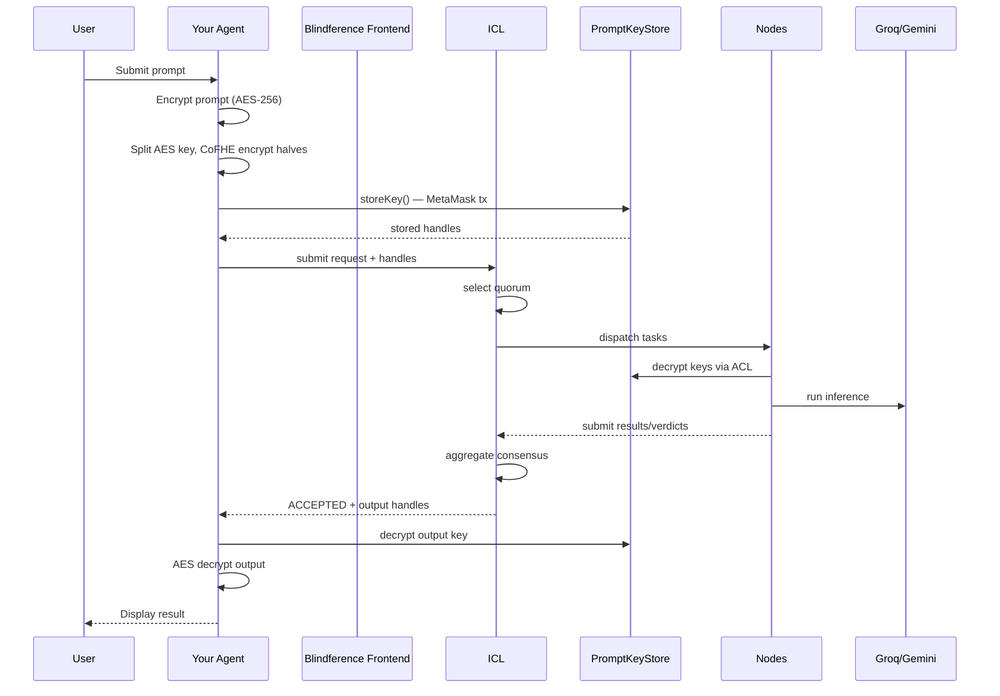

# Architecture for Builders

## Your Agent's Role

As an agent developer, you build applications that sit at the **user layer** — above the ICL and nodes, but below the user interface. Your agent:

1. Receives user input (prompts, features, data)
2. Encrypts locally using CoFHE or AES
3. Submits to the ICL with appropriate permits
4. Polls for results or receives webhooks
5. Decrypts and presents results to the user

## Data Flow



## Integration Points

### 1. CoFHE Encryption (Browser)

**Library**: `@cofhe/sdk@0.5.2`

**Purpose**: Encrypt AES key halves using threshold FHE. Only assigned nodes can decrypt.

**Key functions**:
- `encryptInputs()` — CoFHE-encrypt values
- `storeKey()` — Store encrypted key halves on-chain in PromptKeyStore
- `decryptForView()` — Decrypt values with sharing permits
- `createPermit()` — Create sharing permits for specific nodes

### 2. ICL REST API

**Base URL**: `https://icl.blindference.xyz` (or local `http://127.0.0.1:9000`)

**Key endpoints**:
- `GET /v1/inference/quorum-preview` — Preview selected nodes
- `POST /v1/inference/requests` — Submit inference request
- `GET /v1/inference/{request_id}` — Check request status

### 3. Smart Contracts (Arbitrum Sepolia)

**PromptKeyStore** (`0x1E22dD12f448B15f1Ca8560fB6B4463834FaAf73`):
- `storeKey()` — Store CoFHE-encrypted AES key halves
- `getKey()` — Retrieve stored key halves
- `decryptForView()` — Decrypt with sharing permit

**ResultRegistry** (`0xCebd831eCd00915E299b8Ef2666cAbf942dc7150`):
- `commitResult()` — Commit accepted inference result
- `getResult()` — Retrieve committed result

## Security Considerations

### Input Validation

Always validate user input before encryption:
- Maximum prompt length (to prevent oversized blobs)
- Allowed characters (to prevent injection)
- Rate limiting (to prevent spam)

### Key Management

- AES keys are ephemeral (one per request)
- Never store AES keys in localStorage or cookies
- Use `fheKeyStorage: null` in CoFHE SDK config to prevent IndexedDB caching

### Error Handling

- CoFHE ZK proof generation takes 10-30s — show progress indicator
- Browser may freeze during proof — warn user not to refresh
- Handle "Failed to fetch" with retry logic

## Performance

| Operation | Expected Time | Notes |
|-----------|--------------|-------|
| AES prompt encryption | <100ms | Local browser |
| CoFHE key encryption | 10-30s | ZK proof generation, main thread |
| IPFS upload | 2-10s | Depends on blob size |
| storeKey() tx | 5-15s | Arbitrum Sepolia confirmation |
| Quorum inference | 30-60s | Node execution + consensus |
| Output decryption | 10-20s | CoFHE decrypt + IPFS download |
| **Total end-to-end** | **60-120s** | **Full flow** |

## Scaling Considerations

### Concurrent Requests

The ICL can handle multiple concurrent requests. Each request gets its own quorum.

### Model Selection

Different models have different latency and cost profiles:

| Model | Latency | Cost | Quality |
|-------|---------|------|---------|
| Groq Llama 3.3 70B | Fast | Medium | High |
| Gemini 2.5 Flash | Fast | Low | Medium-High |
| Local vLLM | Variable | Low (compute) | Depends on model |

### Caching

Consider caching:
- Quorum previews (valid for short time)
- IPFS CIDs (immutable, cache forever)
- Encrypted prompts (if user resubmits same prompt)

## Example: Minimal Agent

```typescript
// minimal-agent.ts
import { cofheClient } from '@cofhe/sdk';
import { createWalletClient, custom } from 'viem';

class BlindferenceAgent {
  private iclUrl = 'https://icl.blindference.xyz';
  private wallet: any;

  async init() {
    this.wallet = createWalletClient({
      transport: custom(window.ethereum)
    });
  }

  async submitPrompt(prompt: string, modelId: string) {
    // 1. Encrypt prompt
    const aesKey = crypto.getRandomValues(new Uint8Array(32));
    const encryptedPrompt = await this.aesEncrypt(prompt, aesKey);

    // 2. Split key
    const high = aesKey.slice(0, 16);
    const low = aesKey.slice(16, 32);

    // 3. CoFHE encrypt halves
    const cofhe = await cofheClient.create({
      provider: window.ethereum,
      signer: this.wallet,
      fheKeyStorage: null
    });

    const encHigh = await cofhe.encryptInputs().execute(high);
    const encLow = await cofhe.encryptInputs().execute(low);

    // 4. Upload to IPFS
    const cid = await this.uploadToIPFS(encryptedPrompt);

    // 5. Store key on-chain
    const storeTx = await cofhe.storeKey(encHigh.ctHash, encLow.ctHash);
    await storeTx.wait();

    // 6. Submit to ICL
    const response = await fetch(`${this.iclUrl}/v1/inference/requests`, {
      method: 'POST',
      headers: { 'Content-Type': 'application/json' },
      body: JSON.stringify({
        developer_address: this.wallet.account.address,
        model_id: modelId,
        mode: 'text',
        text_request: {
          prompt_cid: cid,
          encrypted_prompt_key: { high: encHigh.ctHash, low: encLow.ctHash },
          model_id: modelId
        },
        min_tier: 0,
        verifier_count: 2
      })
    });

    return await response.json();
  }

  private async aesEncrypt(plaintext: string, key: Uint8Array): Promise<ArrayBuffer> {
    const iv = crypto.getRandomValues(new Uint8Array(12));
    const encoder = new TextEncoder();
    const data = encoder.encode(plaintext);
    const cryptoKey = await crypto.subtle.importKey('raw', key, 'AES-GCM', false, ['encrypt']);
    return await crypto.subtle.encrypt({ name: 'AES-GCM', iv }, cryptoKey, data);
  }

  private async uploadToIPFS(data: ArrayBuffer): Promise<string> {
    // Implementation using Pinata or other IPFS provider
    // ...
    return 'Qm...';
  }
}
```
