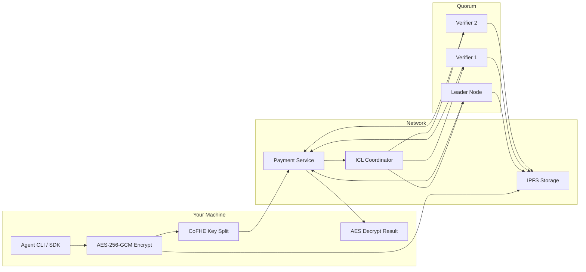

# Architecture

## Overview

The `@abhieren/blindference-agent` SDK provides a complete end-to-end confidential inference pipeline. Your prompt is encrypted locally, submitted to the Blindference network, processed by a quorum of verified nodes, and the result is decrypted locally — all without any plaintext ever touching a server.

## Agent SDK Data Flow

## Step-by-Step Flow

<Steps>
  <Step title="Local Encryption" icon="lock">
    Your prompt is encrypted with AES-256-GCM using an ephemeral key generated on your machine. The ciphertext is uploaded to IPFS.
  </Step>
  <Step title="Key Split and CoFHE" icon="key">
    The AES key is split into two halves. Each half is encrypted with Fhenix CoFHE (Fully Homomorphic Encryption) and stored on-chain in the PromptKeyStore contract.
  </Step>
  <Step title="Job Submission" icon="send">
    The Agent SDK submits the encrypted job to the Payment Service, which creates an on-chain escrow and forwards the request to the ICL (Inference Coordination Layer).
  </Step>
  <Step title="Quorum Selection" icon="users">
    The ICL selects 1 Leader + 2 Verifiers from the pool of attested nodes. Nodes must have valid attestations, minimum stake, and support the requested model.
  </Step>
  <Step title="Node Execution" icon="cpu">
    Each node decrypts its assigned key half via CoFHE ACL, downloads the encrypted prompt from IPFS, reconstructs the AES key, and runs inference via Groq or Gemini.
  </Step>
  <Step title="Consensus Verification" icon="scale">
    The Leader submits a result hash. Verifiers independently re-run inference and submit match/no-match verdicts. 2/3 match = ACCEPTED.
  </Step>
  <Step title="Result Delivery" icon="download">
    The encrypted result is uploaded to IPFS with a new AES key. The output key halves are stored in PromptKeyStore with user-only ACL.
  </Step>
  <Step title="Local Decryption" icon="eye">
    The Agent SDK polls for completion, downloads the encrypted result from IPFS, decrypts the output key via CoFHE threshold decryption, and AES-decrypts the final plaintext.
  </Step>
</Steps>

## Key Properties

| Property | How It's Achieved |
|----------|-------------------|
| **Prompt Privacy** | AES-256-GCM encryption; key split into CoFHE ciphertexts; only your wallet can decrypt |
| **Result Integrity** | SHA-256 commitment; quorum consensus; on-chain settlement |
| **Model Verifiability** | Nodes are attested (TPM/SGX/mock); tier-based selection |
| **No Single Point of Trust** | Leader + 2 verifiers must agree; no one node can cheat |
| **Payment Transparency** | cUSDC credits; on-chain escrow; auto-payout on consensus |

## Components You Interact With

### Payment Service
- **URL**: `https://payment.blindference.xyz`
- **Role**: Creates jobs, manages credit balances, handles escrow, and distributes rewards
- **Endpoints**: `POST /v1/jobs/submit`, `GET /v1/jobs/{jobId}`, `GET /v1/balance/{address}`

### ICL (Inference Coordination Layer)
- **URL**: `https://icl.blindference.xyz`
- **Role**: Validates requests, selects quorums, dispatches tasks, aggregates results, and enforces consensus
- **Endpoints**: `GET /v1/inference/quorum-preview`, `POST /v1/inference/requests`

### IPFS
- **Gateways**: `ipfs.io` (primary), `gateway.pinata.cloud` (fallback), `dweb.link` (fallback)
- **Role**: Stores encrypted prompt and output blobs. Anyone can fetch them, but only the quorum/user can decrypt.

### Smart Contracts (Arbitrum Sepolia)
- **PromptKeyStore**: Stores CoFHE-encrypted AES key halves with ACL enforcement
- **ResultRegistry**: Records accepted inference outcomes with commitment hashes
- **BlindferenceStaking**: Manages node stake, rewards, and slashing

## Performance

| Operation | Expected Time | Notes |
|-----------|--------------|-------|
| AES prompt encryption | `<100ms` | Local, CPU-bound |
| CoFHE key encryption | 10-30s | ZK proof generation, main thread |
| IPFS upload | 2-10s | Depends on blob size |
| Job submission | 2-5s | Payment Service confirmation |
| Quorum inference | 30-60s | Node execution + consensus |
| Output decryption | 10-20s | CoFHE decrypt + IPFS download |
| **Total end-to-end** | **60-120s** | **Full flow** |

## Security Model

### Threat: Prompt Leakage

| Attack Vector | Mitigation |
|---------------|------------|
| Network sniffing | AES-256-GCM + TLS 1.3 |
| IPFS node reads | AES encryption; ciphertext meaningless without key |
| CoFHE threshold network | Fhenix uses multi-party computation; no single party sees plaintext |
| On-chain storage | Only CoFHE ciphertext handles stored; keys are encrypted |

### Threat: Result Tampering

| Attack Vector | Mitigation |
|---------------|------------|
| Leader returns wrong result | 2 verifiers must independently confirm hash match |
| Verifier collusion with leader | Random quorum selection; economic stake at risk |
| Model substitution | Attestation binds node to specific model weights |
| Censorship | Decentralized node network; no single point of control |

## Next Steps

<CardGroup cols={2}>
  <Card title="Quickstart" icon="rocket" href="quickstart">
    Run your first confidential inference in 5 minutes
  </Card>
  <Card title="CLI Reference" icon="terminal" href="cli-reference">
    All commands and options
  </Card>
  <Card title="SDK API" icon="code" href="sdk-api">
    Programmatic usage with TypeScript
  </Card>
  <Card title="Configuration" icon="gear" href="configuration">
    Environment variables and advanced options
  </Card>
</CardGroup>
