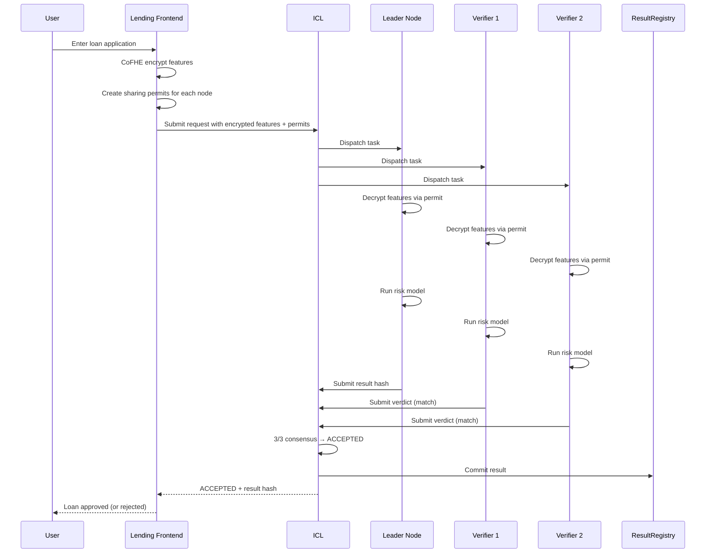

# Example: Risk Scoring Agent

This example shows how to build a DeFi lending protocol that evaluates loan applications without exposing applicant data to any node operator.

## Scenario

A user wants to borrow 10,000 USDC. The protocol needs to evaluate:

- Credit score (0-850)
- Loan amount ($1,000 - $100,000)
- Account age (days)
- Previous defaults (0-10)

All four features are sensitive. The user wants to keep them private.

## Architecture



## Implementation

### Step 1: Frontend Encryption

```typescript title="Frontend encryption code"
import { cofheClient } from '@cofhe/sdk';

async function submitLoanApplication(
  creditScore: number,
  loanAmount: number,
  accountAge: number,
  previousDefaults: number
) {
  const client = await cofheClient.create({
    provider: window.ethereum,
    signer: walletClient,
    fheKeyStorage: null
  });

  // Encrypt features as uint8, uint64, uint16, uint8
  const encCreditScore = await client.encryptInputs().execute(creditScore);
  const encLoanAmount = await client.encryptInputs().execute(BigInt(loanAmount));
  const encAccountAge = await client.encryptInputs().execute(accountAge);
  const encDefaults = await client.encryptInputs().execute(previousDefaults);

  // Get quorum preview
  const preview = await fetch(
    `${ICL_URL}/v1/inference/quorum-preview?model_id=risk-model-v1&verifier_count=2`
  ).then(r => r.json());

  // Create sharing permits for each quorum member
  const permits = await Promise.all([
    preview.leader,
    ...preview.verifiers
  ].map(async (nodeAddress: string) => {
    const permit = await client.createPermit({
      issuer: walletAddress,
      recipient: nodeAddress,
      ciphertextHandles: [
        encCreditScore.ctHash,
        encLoanAmount.ctHash,
        encAccountAge.ctHash,
        encDefaults.ctHash
      ]
    });
    return {
      node: nodeAddress,
      permit: client.permitUtils.export(permit)
    };
  }));

  // Submit request
  const response = await fetch(`${ICL_URL}/v1/inference/requests`, {
    method: 'POST',
    headers: { 'Content-Type': 'application/json' },
    body: JSON.stringify({
      developer_address: walletAddress,
      model_id: 'risk-model-v1',
      mode: 'risk',
      encrypted_features: [
        { ctHash: encCreditScore.ctHash, utype: 6, signature: encCreditScore.signature },
        { ctHash: encLoanAmount.ctHash, utype: 6, signature: encLoanAmount.signature },
        { ctHash: encAccountAge.ctHash, utype: 6, signature: encAccountAge.signature },
        { ctHash: encDefaults.ctHash, utype: 6, signature: encDefaults.signature }
      ],
      feature_types: ['credit_score', 'loan_amount', 'account_age', 'previous_defaults'],
      permits,
      min_tier: 0,
      verifier_count: 2
    })
  });

  return await response.json();
}
```

### Step 2: Node Risk Model

Nodes run a simple risk scoring algorithm:

```python title="risk_model.py"
def evaluate_risk(credit_score: int, loan_amount: int,
                  account_age: int, previous_defaults: int) -> int:
    """
    Returns risk score 0-100 (0 = lowest risk, 100 = highest risk)
    """
    # Credit score weight: 40%
    credit_factor = max(0, (850 - credit_score) / 850 * 40)

    # Loan amount weight: 20%
    amount_factor = min(20, loan_amount / 50000 * 20)

    # Account age weight: 20%
    age_factor = max(0, (365 - account_age) / 365 * 20)

    # Defaults weight: 20%
    defaults_factor = previous_defaults * 2

    return int(credit_factor + amount_factor + age_factor + defaults_factor)
```

### Step 3: Protocol Decision

```typescript title="Process loan result"
async function processLoanResult(requestId: string) {
  const status = await fetch(`${ICL_URL}/v1/inference/${requestId}`).then(r => r.json());

  if (status.status !== 'ACCEPTED') {
    return { approved: false, reason: 'Quorum rejected' };
  }

  // Get the committed result from blockchain
  const result = await resultRegistry.getResult(status.task_id);
  const riskScore = parseInt(result.resultHash, 16); // Simplified

  // Decision threshold
  const approved = riskScore < 60;
  const interestRate = approved ? 5 + (riskScore / 20) : 0;

  return {
    approved,
    riskScore,
    interestRate: approved ? `${interestRate}%` : null,
    onChainProof: result.resultHash
  };
}
```

## Privacy Guarantees

| Entity | What They See | Privacy Level |
|--------|--------------|---------------|
| User | Their own plaintext | Full control |
| Frontend | Ciphertexts only | No plaintext exposure |
| ICL | Ciphertext handles only | Cannot decrypt |
| Leader Node | Decrypted features temporarily | Attested + bonded |
| Verifiers | Decrypted features temporarily | Cross-validation catches cheating |
| Blockchain | Result hash only | No feature exposure |

## Variations

<Accordion title="Insurance Underwriting">
  Replace loan application with insurance application:
  - Medical history (hashed, encrypted)
  - Age, location, occupation
  - Coverage amount requested
</Accordion>

<Accordion title="Credit Card Approval">
  - Income (encrypted)
  - Existing debt (encrypted)
  - Payment history (encrypted)
  - Spending patterns (encrypted)
</Accordion>

<Accordion title="KYC/AML Scoring">
  - Transaction history (encrypted)
  - Wallet age, activity
  - Cross-chain behavior
  - Risk flags (sanctions, etc.)
</Accordion>
