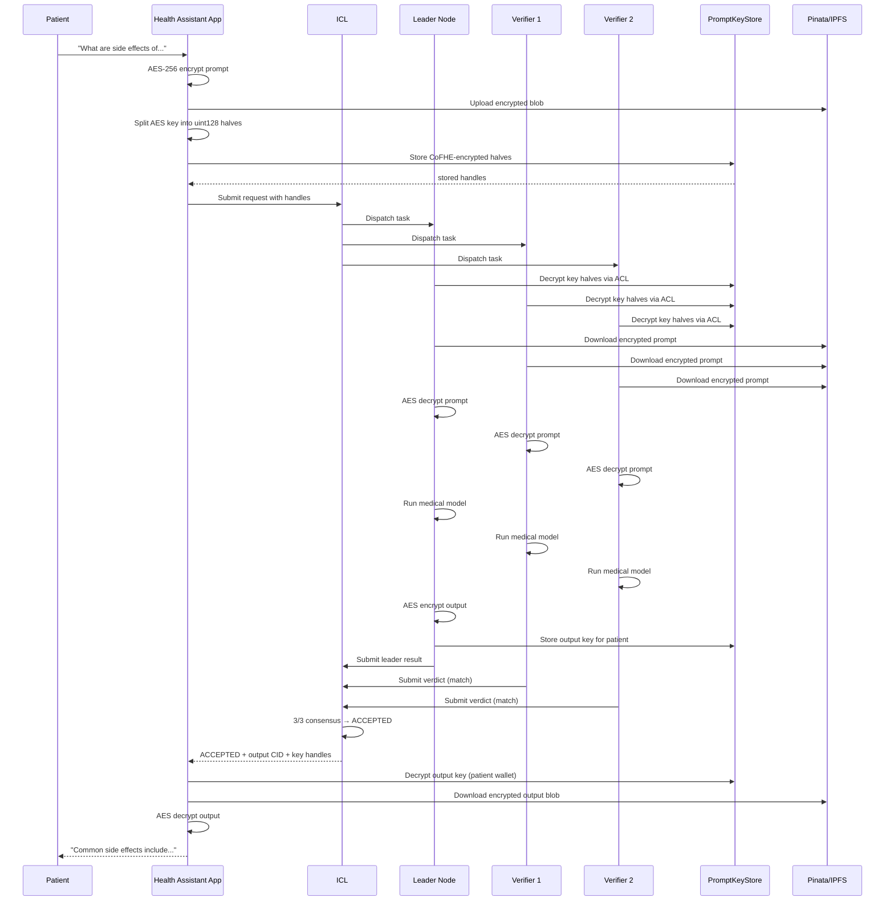

# Example: Text Inference Agent

This example shows how to build a confidential AI assistant where user prompts are encrypted before upload and only the user can decrypt the final answer.

## Scenario

A healthcare company wants to let patients ask medical questions via AI without exposing PHI (Protected Health Information) to model providers or node operators.

## Architecture



## Implementation

### Step 1: Browser Encryption

```typescript title="ConfidentialHealthAssistant.ts"
import { cofheClient } from '@cofhe/sdk';

class ConfidentialHealthAssistant {
  private client: any;
  private wallet: any;

  async init() {
    this.wallet = createWalletClient({ transport: custom(window.ethereum) });
    this.client = await cofheClient.create({
      provider: window.ethereum,
      signer: this.wallet,
      fheKeyStorage: null,
      useWorkers: false
    });
  }

  async askQuestion(question: string): Promise<string> {
    // 1. Generate AES key
    const aesKey = crypto.getRandomValues(new Uint8Array(32));

    // 2. Encrypt prompt with AES-256-GCM
    const { encryptedPrompt, iv } = await this.aesEncrypt(question, aesKey);

    // 3. Upload encrypted blob to IPFS
    const promptCid = await this.uploadToIPFS(encryptedPrompt);

    // 4. Split AES key into two uint128 halves
    const keyHigh = aesKey.slice(0, 16);
    const keyLow = aesKey.slice(16, 32);

    // 5. CoFHE encrypt each half
    const encHigh = await this.client.encryptInputs().execute(keyHigh);
    const encLow = await this.client.encryptInputs().execute(keyLow);

    // 6. Store on-chain (MetaMask tx)
    const storeTx = await this.client.storeKey(encHigh.ctHash, encLow.ctHash);
    await storeTx.wait();

    // 7. Submit to ICL
    const response = await fetch(`${ICL_URL}/v1/inference/requests`, {
      method: 'POST',
      headers: { 'Content-Type': 'application/json' },
      body: JSON.stringify({
        developer_address: this.wallet.account.address,
        model_id: 'gemini:gemini-2.5-flash',
        mode: 'text',
        text_request: {
          prompt_cid: promptCid,
          encrypted_prompt_key: {
            high: encHigh.ctHash,
            low: encLow.ctHash
          },
          model_id: 'gemini:gemini-2.5-flash',
          coverage_enabled: false
        },
        min_tier: 0,
        verifier_count: 2,
        metadata: {
          cofhe_prompt_key_inputs: {
            high: { ctHash: encHigh.ctHash, securityZone: 0, utype: 6, signature: '0x' },
            low: { ctHash: encLow.ctHash, securityZone: 0, utype: 6, signature: '0x' }
          }
        }
      })
    });

    const { job_id } = await response.json();

    // 8. Poll for result
    const result = await this.pollForResult(job_id);

    // 9. Decrypt output
    return await this.decryptOutput(result);
  }

  private async aesEncrypt(plaintext: string, key: Uint8Array) {
    const iv = crypto.getRandomValues(new Uint8Array(12));
    const encoder = new TextEncoder();
    const cryptoKey = await crypto.subtle.importKey('raw', key, 'AES-GCM', false, ['encrypt']);
    const encrypted = await crypto.subtle.encrypt(
      { name: 'AES-GCM', iv },
      cryptoKey,
      encoder.encode(plaintext)
    );
    return { encryptedPrompt: new Uint8Array(encrypted), iv };
  }

  private async uploadToIPFS(data: Uint8Array): Promise<string> {
    const formData = new FormData();
    formData.append('file', new Blob([data]));

    const res = await fetch('https://api.pinata.cloud/pinning/pinFileToIPFS', {
      method: 'POST',
      headers: { Authorization: `Bearer ${PINATA_JWT}` },
      body: formData
    });
    return (await res.json()).IpfsHash;
  }

  private async pollForResult(jobId: string) {
    while (true) {
      const status = await fetch(`${ICL_URL}/v1/inference/${jobId}`).then(r => r.json());
      if (status.status === 'ACCEPTED') return status;
      if (status.status === 'REJECTED') throw new Error('Quorum rejected');
      await new Promise(r => setTimeout(r, 5000));
    }
  }

  private async decryptOutput(result: any): Promise<string> {
    // 1. Decrypt output key from PromptKeyStore
    const outputKeyHigh = await this.client.decryptForView(result.encrypted_output_key_high)
      .withPermit(this.userPermit);
    const outputKeyLow = await this.client.decryptForView(result.encrypted_output_key_low)
      .withPermit(this.userPermit);

    // 2. Reconstruct AES key
    const outputKey = new Uint8Array([...outputKeyHigh.value, ...outputKeyLow.value]);

    // 3. Download encrypted output blob
    const encryptedOutput = await fetch(
      `${IPFS_GATEWAY}/ipfs/${result.output_cid}`
    ).then(r => r.arrayBuffer());

    // 4. AES decrypt
    const iv = new Uint8Array(encryptedOutput.slice(0, 12));
    const ciphertext = new Uint8Array(encryptedOutput.slice(12));
    const cryptoKey = await crypto.subtle.importKey('raw', outputKey, 'AES-GCM', false, ['decrypt']);
    const decrypted = await crypto.subtle.decrypt({ name: 'AES-GCM', iv }, cryptoKey, ciphertext);

    return new TextDecoder().decode(decrypted);
  }
}
```

## Privacy Guarantees

| Entity | Access | Privacy Level |
|--------|--------|---------------|
| Patient | Full plaintext | Self — owns wallet |
| App | Encrypted blobs | No plaintext in storage |
| IPFS | Encrypted blobs only | No key to decrypt |
| ICL | Ciphertext handles only | Cannot decrypt |
| Nodes | Temporary decrypted prompt | Attested + cross-validated |
| Model Provider | Never sees prompt | Zero-knowledge |
| Blockchain | Hashes only | No content exposure |

## Key Security Properties

<Steps>
  <Step title="End-to-end encryption" icon="lock">
    Prompt encrypted in browser, never in plaintext on server
  </Step>
  <Step title="Key access control" icon="key">
    Only assigned quorum nodes can decrypt (CoFHE ACL)
  </Step>
  <Step title="Verifiable execution" icon="check-double">
    3 nodes run same inference, 2 must match
  </Step>
  <Step title="Output exclusivity" icon="eye">
    Only the patient wallet can decrypt the answer
  </Step>
  <Step title="No persistent keys" icon="trash">
    AES keys are ephemeral (one per request)
  </Step>
</Steps>

## Variations

<Accordion title="Legal Document Analysis">
  - Upload contracts, NDAs, legal briefs
  - Ask questions about clauses, risks, obligations
  - Maintain attorney-client privilege through encryption
</Accordion>

<Accordion title="Financial Advisory">
  - Portfolio analysis
  - Tax optimization suggestions
  - Investment research
  - Keep financial data confidential
</Accordion>

<Accordion title="Mental Health Support">
  - Therapy chatbot
  - Mood tracking and analysis
  - Crisis intervention
  - HIPAA-compliant by design (encryption + access control)
</Accordion>

<Accordion title="Enterprise Knowledge Base">
  - Internal documentation Q&A
  - Proprietary algorithm explanations
  - Trade secret analysis
  - Competitive intelligence queries
</Accordion>
