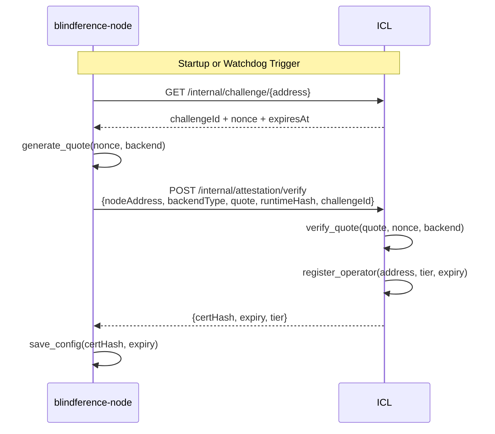

# Attestation Guide

Attestation provides cryptographic proof that a node is running the expected inference engine and hasn't been tampered with. The ICL verifies this proof before the node is eligible for job assignments.

## Why Attestation Matters

Without attestation, any node could claim to be running the correct software while actually running tampered models that produce wrong (or malicious) outputs. Attestation closes this trust gap.

## Attestation Backends

<Tabs>
  <Tab title="Mock (Tier 0 — Current)">
    **Key**: `weloveblindference` (default HMAC-SHA256 key, override via `MOCK_ATTESTATION_KEY` env var)

    **How it works**:
    1. The ICL issues a random challenge nonce
    2. The node computes `HMAC-SHA256(key="weloveblindference", msg=challenge)`
    3. The ICL verifies the HMAC with the same key

    **Trust guarantee**: None. This is purely for pipeline validation and developer testing. Nodes using mock attestation are **tier 0** but are still eligible for all jobs (leader and verifier) because all current models are tier 0.

    **Use case**: Development, testing, initial integration

    **Commands**:

    ```bash title="Mock attestation"
    # With --mock flag (skips interactive selection)
    blindference-node attest --mock

    # With custom dev key
    blindference-node attest --mock --tee-key mydevkey
    ```

    The `--mock` flag is required. The CLI checks `MOCK_ATTESTATION_KEY` env var first, then falls back to `weloveblindference`. The `--tee-key` flag overrides the key for development TEE simulation.
  </Tab>
  <Tab title="TPM 2.0 (Tier 1 — Next Phase)">
    **How it will work**:
    1. The ICL issues a challenge nonce
    2. The node uses `tpm2-tools` to create a TPM quote binding the challenge to PCR values
    3. The inference engine hash is loaded into PCR 15 at startup
    4. The ICL verifies the quote against the node's endorsement key

    **Trust guarantee**: OS-level integrity. Proves the node runs the expected software stack.

    **Hardware required**: TPM 2.0 chip (standard on most machines since 2016)

    **Use case**: Production nodes needing hardware-backed trust
  </Tab>
  <Tab title="TEE/SGX (Tier 2 — Future)">
    **How it will work**:
    1. The node daemon runs inside an SNP-protected process or TDX trust domain
    2. The AES prompt key is only materialized within the enclave's encrypted memory
    3. Manufacturer-signed attestation quote generated
    4. The ICL verifies against AMD/Intel certificate chain

    **Trust guarantee**: Hardware-enforced memory encryption. Even the machine owner cannot read process memory.

    **Hardware required**: AMD EPYC with SEV-SNP or Intel Xeon with TDX

    **Use case**: Maximum security for sensitive inference workloads
  </Tab>
</Tabs>

## Attestation Flow



## Auto-Re-Attestation

Nodes now self-heal without manual intervention:

<Steps>
  <Step title="Startup check" icon="power">
    On `blindference-node run`, the daemon checks if the certificate is missing or expired
  </Step>
  <Step title="Auto-re-attest" icon="refresh-cw">
    Automatically generates a new quote, submits to ICL, persists the new certificate
  </Step>
  <Step title="Watchdog" icon="shield">
    Background task checks every 10 minutes. If certificate expires within 6 hours, triggers re-attestation proactively
  </Step>
</Steps>

This eliminates the operational burden of manually re-attesting nodes after ICL restarts or certificate expiry.

<Warning>
  Auto-re-attestation requires ICL connectivity. If the ICL is unreachable, the daemon will log warnings but continue running with the existing certificate until it expires.
</Warning>

## Manual Re-Attestation

While auto-re-attest handles all cases, you can manually trigger it:

```bash title="Manual mock attestation"
# Mock attestation (development)
blindference-node attest --mock

# With custom mock key
MOCK_ATTESTATION_KEY=mydevkey blindference-node attest --mock
```

### Interactive Attestation Flow (without --mock)

If you run `blindference-node attest` without `--mock`, the CLI presents an interactive menu:

```bash title="Interactive attestation prompt"
Attestation type:
  [1] Mock (development)
  [2] TEE / TPM (production)
Select [1]:
```

- **Option 1 (Mock)**: Proceeds with mock attestation using `weloveblindference`
- **Option 2 (TEE)**: Explains hardware requirements, then offers **"Use development TEE simulation?"** — if yes, prompts for an attestation key (default `weloveblindference`) and proceeds as a development attestation

After ICL attestation succeeds, the CLI will ask:

```bash title="On-chain registration prompt"
Do you want to register on-chain? [Y/n]:
  → If YES: estimates gas, shows cost, sends NodeRegistry.register() tx
  → If NO:  continues with ICL-only mock attestation (no stake required)
```

The on-chain registration is optional for mock/development tiers. Production tiers (TPM/TEE) require on-chain registration.

## Certificate Lifecycle

| Event | Action | Frequency |
|-------|--------|-----------|
| Initial startup | Auto-attest | Once |
| Expiry < 6h | Watchdog re-attest | Every 10min check |
| Expiry detected | Immediate re-attest | On startup/run |
| ICL restart | Node auto-re-attests | Next heartbeat cycle |

## Tier Capabilities

| Capability | Tier 0 | Tier 1 | Tier 2 |
|------------|--------|--------|--------|
| Verifier jobs | ✅ | ✅ | ✅ |
| Leader jobs | ✅ | ✅ | ✅ |
| High-value tasks | ✅ | ✅ | ✅ |
| Premium fee rate | ❌ | ✅ | ✅ |

<Info>
  All current built-in models (`facebook/opt-125m`, `groq:llama-3.3-70b-versatile`, `gemini:gemini-2.5-flash`) are tier 0, so tier 0 nodes participate in all quorums. Future models may require higher tiers.
</Info>

## Troubleshooting

<Accordion title="Attestation certificate expired">
  The daemon will auto-re-attest. If it fails:

  1. Check ICL connectivity: `curl $BLF_ICL_ENDPOINT/health`
  2. Check network access to ICL
  3. Restart the daemon: `blindference-node run`
</Accordion>

<Accordion title="Attestation rejected by ICL">
  - For mock backend: Ensure you're using the correct hardcoded key
  - For TPM: Check `tpm2-tools` installation and TPM chip availability
  - For TEE: Verify enclave is properly initialized
</Accordion>

<Accordion title="Certificate expiry in the past">
  System clock may be wrong. Verify:

  ```bash title="Check system time"
  date  # Should show current UTC time
  ```
</Accordion>
