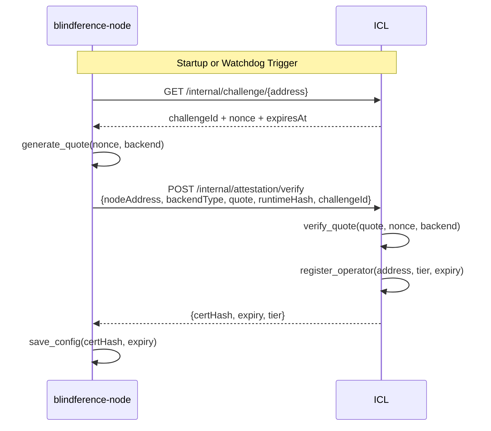

# Attestation Guide

Attestation provides cryptographic proof that a node is running the expected inference engine and hasn't been tampered with. The ICL verifies this proof before the node is eligible for job assignments.

## Why Attestation Matters

Without attestation, any node could claim to be running the correct software while actually running tampered models that produce wrong (or malicious) outputs. Attestation closes this trust gap.

## Attestation Backends

### Mock Attestation (Current — Tier 0)

**Key**: `weloveblindference` (hardcoded HMAC-SHA256 key)

**How it works**:
1. The ICL issues a random challenge nonce
2. The node computes `HMAC-SHA256(key="weloveblindference", msg=challenge)`
3. The ICL verifies the HMAC with the same key

**Trust guarantee**: None. This is purely for pipeline validation and developer testing. Nodes using mock attestation are **capped at tier 0** (low-value, verifier-only jobs).

**Use case**: Development, testing, initial integration

### TPM 2.0 (Next Phase — Tier 1)

**How it will work**:
1. The ICL issues a challenge nonce
2. The node uses `tpm2-tools` to create a TPM quote binding the challenge to PCR values
3. The inference engine hash is loaded into PCR 15 at startup
4. The ICL verifies the quote against the node's endorsement key

**Trust guarantee**: OS-level integrity. Proves the node runs the expected software stack.

**Hardware required**: TPM 2.0 chip (standard on most machines since 2016)

**Use case**: Production nodes needing hardware-backed trust

### AMD SEV-SNP / Intel TDX (Future — Tier 2)

**How it will work**:
1. The node daemon runs inside an SNP-protected process or TDX trust domain
2. The AES prompt key is only materialized within the enclave's encrypted memory
3. Manufacturer-signed attestation quote generated
4. The ICL verifies against AMD/Intel certificate chain

**Trust guarantee**: Hardware-enforced memory encryption. Even the machine owner cannot read process memory.

**Hardware required**: AMD EPYC with SEV-SNP or Intel Xeon with TDX

**Use case**: Maximum security for sensitive inference workloads

## Attestation Flow



## Auto-Re-Attestation

Nodes now self-heal without manual intervention:

- **Startup check**: On `blindference-node run`, the daemon checks if the certificate is missing or expired
- **Auto-re-attest**: Automatically generates a new quote, submits to ICL, persists the new certificate
- **Watchdog**: Background task checks every 10 minutes. If certificate expires within 6 hours, triggers re-attestation proactively

This eliminates the operational burden of manually re-attesting nodes after ICL restarts or certificate expiry.

## Manual Re-Attestation

While auto-re-attest handles all cases, you can manually trigger it:

```bash
blindference-node attest
```

Note: This is currently a stub — the auto-re-attest mechanism is the recommended path.

## Certificate Lifecycle

| Event | Action | Frequency |
|-------|--------|-----------|
| Initial startup | Auto-attest | Once |
| Expiry < 6h | Watchdog re-attest | Every 10min check |
| Expiry detected | Immediate re-attest | On startup/run |
| ICL restart | Node auto-re-attests | Next heartbeat cycle |

## Tier Capabilities

| Capability | Tier 0 | Tier 1 | Tier 2 |
|------------|--------|--------|--------|
| Verifier jobs | ✅ | ✅ | ✅ |
| Leader jobs | ❌ | ✅ | ✅ |
| High-value tasks | ❌ | ✅ | ✅ |
| Premium fee rate | ❌ | ✅ | ✅ |

## Troubleshooting

### "Attestation certificate expired"

The daemon will auto-re-attest. If it fails:

1. Check ICL connectivity: `curl $BLF_ICL_ENDPOINT/health`
2. Check network access to ICL
3. Restart the daemon: `blindference-node run`

### "Attestation rejected by ICL"

- For mock backend: Ensure you're using the correct hardcoded key
- For TPM: Check `tpm2-tools` installation and TPM chip availability
- For TEE: Verify enclave is properly initialized

### "Certificate expiry in the past"

System clock may be wrong. Verify:

```bash
date  # Should show current UTC time
```
