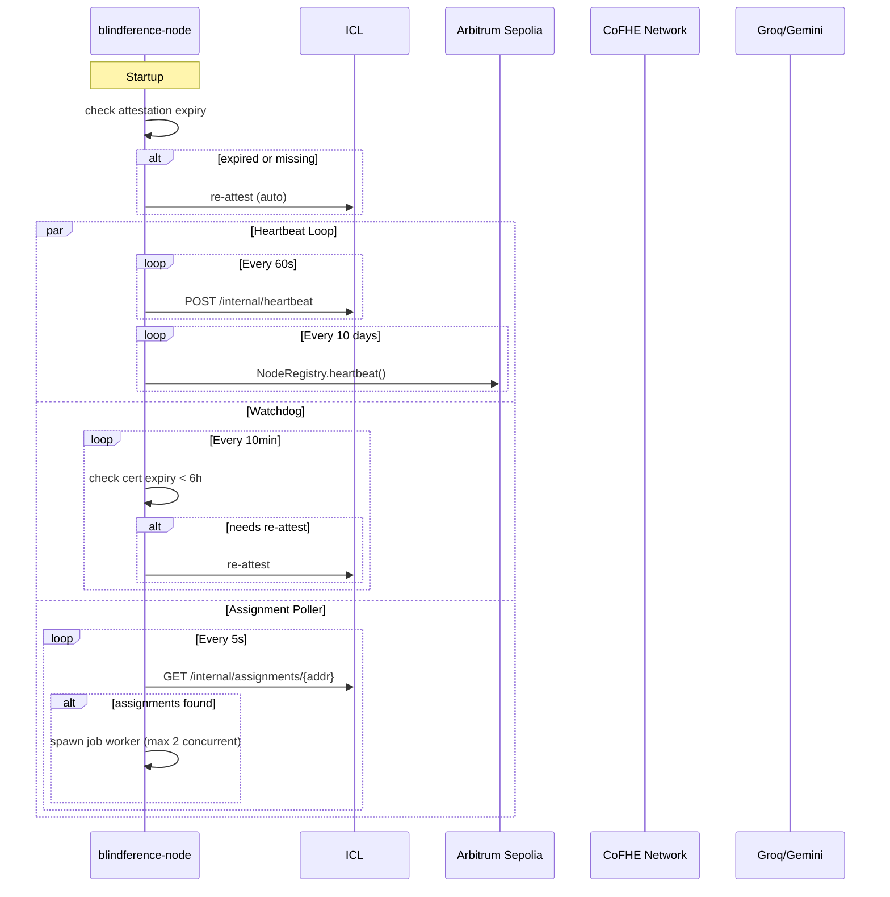
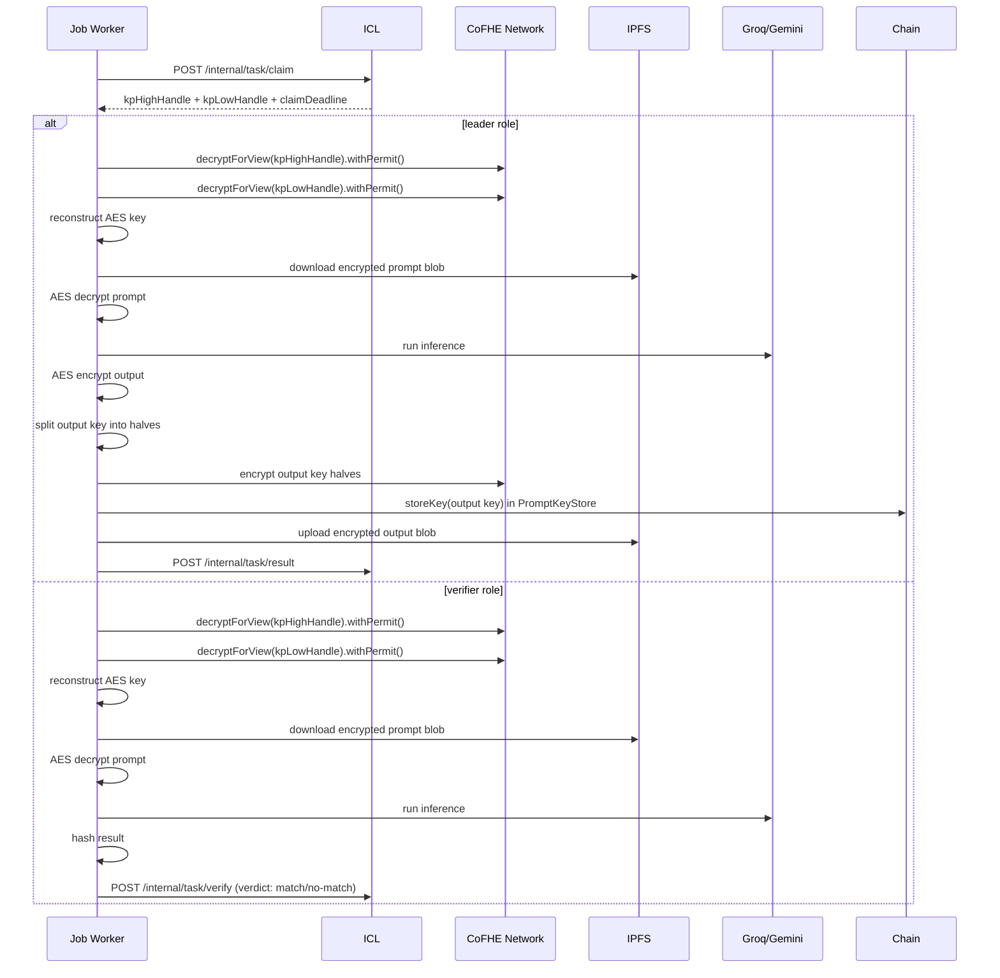

# Running a Node

## Prerequisites

Before starting the daemon, you must have:

<Steps>
  <Step title="Initialize your node" icon="settings">
    `blindference-node init` completed successfully
  </Step>
  <Step title="Attest with the ICL" icon="shield">
    `blindference-node attest --mock` (or interactive flow) completed
  </Step>
</Steps>

<Warning>
  Without attestation, the daemon will exit with:
  ```
  Error: No attestation found. Run `blindference-node attest` first.
  ```
</Warning>

## Start the Daemon

<Tabs>
  <Tab title="Interactive (Default)">
    ```bash title="Start daemon interactively"
    blindference-node run
    ```
    Enter your keystore password when prompted.
  </Tab>
  <Tab title="Non-Interactive">
    ```bash title="Start daemon non-interactively"
    export BLF_KEY_PASSWORD=secure_password
    blindference-node run
    ```
    Uses environment variable for password — useful for background services.
  </Tab>
</Tabs>

The daemon starts four concurrent loops:

| Loop | Frequency | Purpose |
|------|-----------|---------|
| **ICL Heartbeat** | Every 60s | Proves liveness to ICL (free REST call) |
| **On-Chain Heartbeat** | Every 10 days | Proves liveness to NodeRegistry (gas tx) |
| **Attestation Watchdog** | Every 10min | Auto-re-attests if certificate expires within 6h |
| **Assignment Poller** | Every 5s | Polls ICL for pending inference jobs |

## Daemon Lifecycle



## Job Execution Flow

When an assignment is received, the worker executes:



## Monitoring the Daemon

### Console Output

The daemon logs to stdout with structured log lines:

```bash title="Example daemon output"
[2026-05-18T10:25:00] [INFO   ] [0xdDef3Cf5] Daemon starting …
[2026-05-18T10:25:00] [INFO   ] [0xdDef3Cf5]   Address : 0xdDef3Cf5A4d0A6404Bc084D74de3E2c0d6147dA5
[2026-05-18T10:25:00] [INFO   ] [0xdDef3Cf5]   Tier    : 0
[2026-05-18T10:25:00] [INFO   ] [0xdDef3Cf5]   Models  : qwen2.5-7b
[2026-05-18T10:25:00] [INFO   ] [0xdDef3Cf5]   Cert    : expires in 604663s
[2026-05-18T10:25:00] [INFO   ] [0xdDef3Cf5] Heartbeat sent to ICL
[2026-05-18T10:25:00] [INFO   ] [0xdDef3Cf5] No assignments for last 60s
[2026-05-18T10:35:00] [INFO   ] [0xdDef3Cf5] Received 1 assignment(s)
[2026-05-18T10:35:00] [INFO   ] [0xdDef3Cf5] Spawning leader job 0xabc123…
[2026-05-18T10:35:00] [INFO   ] [0xdDef3Cf5] Job 0xabc123: starting as leader
[2026-05-18T10:35:00] [INFO   ] [0xdDef3Cf5] Job 0xabc123: claimed
```

### CLI Monitoring Commands

In a separate terminal (while the daemon runs), you can query your node's status:

```bash title="Check node configuration and attestation"
blindference-node status
```

```bash title="List recent completed jobs with earnings"
blindference-node jobs list --limit 10
```

```bash title="Total BLIND earned across all completed jobs"
blindference-node jobs earnings
```

```bash title="Check on-chain stake, consecutive failures, slash risk"
blindference-node staking status
```

```bash title="BLIND token balance in your wallet"
blindference-node balance
```

### Log Levels

| Level | Use |
|-------|-----|
| `DEBUG` | Full request/response bodies, CoFHE operations, model prompts |
| `INFO`  | Heartbeats, job starts/completions, attestation events |
| `WARNING` | Claim failures, heartbeat failures, CoFHE errors (non-fatal) |
| `ERROR` | Job aborts, attestation failures, IPFS failures |

Set log level via environment:

```bash title="Run with debug logging"
BLF_LOG_LEVEL=DEBUG blindference-node run
```

## Stopping the Daemon

Press `Ctrl+C` (SIGINT) or send SIGTERM:

```bash title="Graceful shutdown"
kill -SIGTERM <pid>
```

The daemon handles shutdown gracefully:

<Steps>
  <Step title="Stop accepting" icon="hand">
    Stops accepting new assignments
  </Step>
  <Step title="Wait for jobs" icon="clock">
    Waits for running jobs to complete (or timeout)
  </Step>
  <Step title="Final heartbeat" icon="heart">
    Sends final heartbeat
  </Step>
  <Step title="Exit" icon="log-out">
    Exits cleanly
  </Step>
</Steps>

## Running Multiple Nodes

You can run multiple nodes on the same machine (for testing) by using different config directories:

```bash title="Node 1"
export BLF_CONFIG_PATH=/tmp/node1/config.json
blindference-node init
blindference-node run
```

```bash title="Node 2 (another terminal)"
export BLF_CONFIG_PATH=/tmp/node2/config.json
blindference-node init
blindference-node run
```

Each node needs a unique wallet and should use a unique ICL operator key.

## Background Operation

<Tabs>
  <Tab title="systemd (Linux)">
    Create `/etc/systemd/system/blindference-node.service`:

    ```ini title="systemd service file"
    [Unit]
    Description=Blindference Node Daemon
    After=network.target

    [Service]
    Type=simple
    User=blindference
    Environment=BLF_KEY_PASSWORD=secure_password
    Environment=BLF_LOG_LEVEL=INFO
    WorkingDirectory=/home/blindference
    ExecStart=/usr/local/bin/blindference-node run
    Restart=on-failure
    RestartSec=10

    [Install]
    WantedBy=multi-user.target
    ```

    ```bash title="Enable and start service"
    sudo systemctl enable blindference-node
    sudo systemctl start blindference-node
    sudo systemctl status blindference-node
    ```
  </Tab>
  <Tab title="Docker">
    ```bash title="Run daemon in Docker"
    docker run -d \
      --name blindference-node \
      -e BLF_KEY_PASSWORD=secure_password \
      -e BLF_ICL_ENDPOINT=https://icl.blindference.xyz \
      -v /host/config:/root/.blindference \
      blindference-node
    ```
  </Tab>
  <Tab title="nohup / screen / tmux">
    ```bash title="Simple background"
    nohup blindference-node run > node.log 2>&1 &
    ```

    ```bash title="Using screen"
    screen -S blindference
    blindference-node run
    # Detach: Ctrl+A, D
    # Reattach: screen -r blindference
    ```
  </Tab>
</Tabs>
