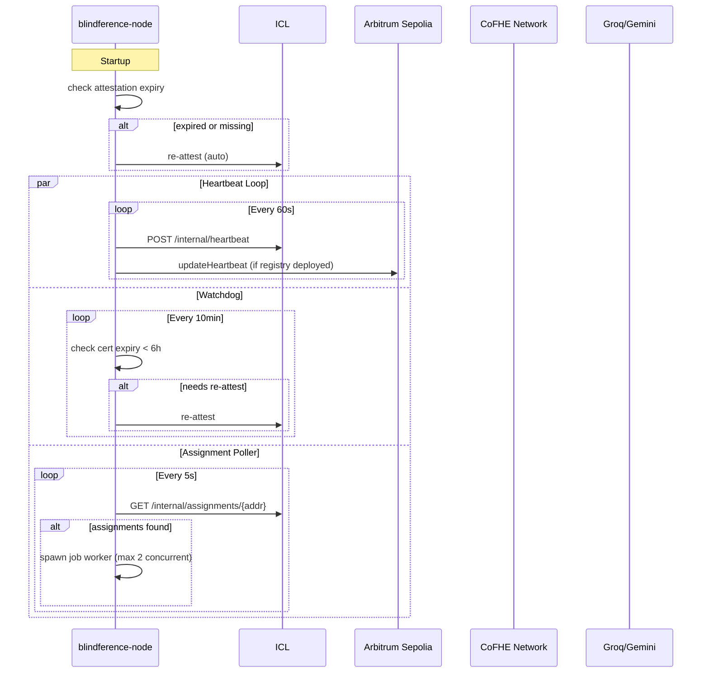
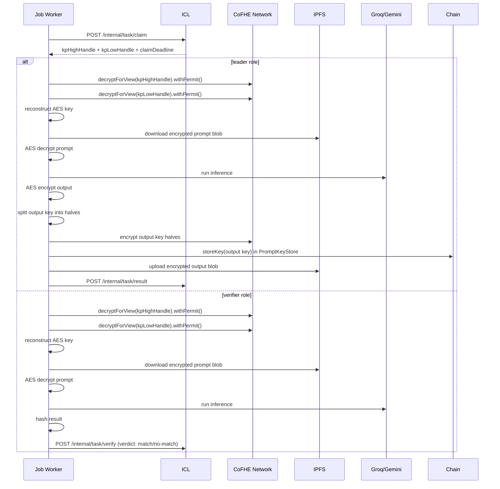

# Running a Node

## Start the Daemon

```bash
# Interactive — prompts for keystore password
blindference-node run

# Non-interactive — uses environment variable
export BLF_KEY_PASSWORD=secure_password
blindference-node run
```

The daemon starts three concurrent loops:

| Loop | Frequency | Purpose |
|------|-----------|---------|
| **Heartbeat** | Every 60s | Proves liveness to ICL and on-chain registry |
| **Attestation Watchdog** | Every 10min | Auto-re-attests if certificate expires within 6h |
| **Assignment Poller** | Every 5s | Polls ICL for pending inference jobs |

## Daemon Lifecycle



## Job Execution Flow

When an assignment is received, the worker executes:



## Monitoring the Daemon

### Console Output

The daemon logs to stdout with structured log lines:

```
[2026-05-18T10:25:00] [INFO   ] [0xdDef3Cf5] Daemon starting ...
[2026-05-18T10:25:00] [INFO   ] [0xdDef3Cf5]   Address : 0xdDef3Cf5A4d0A6404Bc084D74de3E2c0d6147dA5
[2026-05-18T10:25:00] [INFO   ] [0xdDef3Cf5]   Tier    : 0
[2026-05-18T10:25:00] [INFO   ] [0xdDef3Cf5]   Models  : qwen2.5-7b
[2026-05-18T10:25:00] [INFO   ] [0xdDef3Cf5]   Cert    : expires in 604663s
[2026-05-18T10:25:00] [INFO   ] [0xdDef3Cf5] Heartbeat sent to ICL
[2026-05-18T10:25:00] [INFO   ] [0xdDef3Cf5] No assignments for last 60s
[2026-05-18T10:35:00] [INFO   ] [0xdDef3Cf5] Received 1 assignment(s)
[2026-05-18T10:35:00] [INFO   ] [0xdDef3Cf5] Spawning leader job 0xabc123...
[2026-05-18T10:35:00] [INFO   ] [0xdDef3Cf5] Job 0xabc123: starting as leader
[2026-05-18T10:35:00] [INFO   ] [0xdDef3Cf5] Job 0xabc123: claimed
```

### Log Levels

| Level | Use |
|-------|-----|
| `DEBUG` | Full request/response bodies, CoFHE operations, model prompts |
| `INFO`  | Heartbeats, job starts/completions, attestation events |
| `WARNING` | Claim failures, heartbeat failures, CoFHE errors (non-fatal) |
| `ERROR` | Job aborts, attestation failures, IPFS failures |

Set log level via environment:

```bash
BLF_LOG_LEVEL=DEBUG blindference-node run
```

## Stopping the Daemon

Press `Ctrl+C` (SIGINT) or send SIGTERM:

```bash
kill -SIGTERM <pid>
```

The daemon handles shutdown gracefully:
1. Stops accepting new assignments
2. Waits for running jobs to complete (or timeout)
3. Sends final heartbeat
4. Exits

## Running Multiple Nodes

You can run multiple nodes on the same machine (for testing) by using different config directories:

```bash
# Node 1
export BLF_CONFIG_PATH=/tmp/node1/config.json
blindference-node init
blindference-node run

# Node 2 (in another terminal)
export BLF_CONFIG_PATH=/tmp/node2/config.json
blindference-node init
blindference-node run
```

Each node needs a unique wallet and should use a unique ICL operator key.

## Background Operation

### Using systemd (Linux)

Create `/etc/systemd/system/blindference-node.service`:

```ini
[Unit]
Description=Blindference Node Daemon
After=network.target

[Service]
Type=simple
User=blindference
Environment=BLF_KEY_PASSWORD=secure_password
Environment=BLF_LOG_LEVEL=INFO
WorkingDirectory=/home/blindference
ExecStart=/usr/local/bin/blindference-node run
Restart=on-failure
RestartSec=10

[Install]
WantedBy=multi-user.target
```

```bash
sudo systemctl enable blindference-node
sudo systemctl start blindference-node
sudo systemctl status blindference-node
```

### Using Docker

```bash
docker run -d \
  --name blindference-node \
  -e BLF_KEY_PASSWORD=secure_password \
  -e BLF_ICL_ENDPOINT=https://icl.blindference.xyz \
  -v /host/config:/root/.blindference \
  blindference-node
```

### Using nohup / screen / tmux

```bash
# Simple background
nohup blindference-node run > node.log 2>&1 &

# Or with screen
screen -S blindference
blindference-node run
# Detach: Ctrl+A, D
# Reattach: screen -r blindference
```
