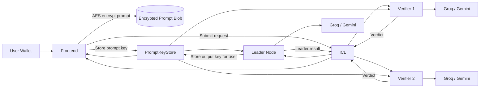

# Welcome to Blindference

Blindference is a confidential AI execution layer for Web3. It enables users to submit sensitive prompts and data to frontier AI models — Groq Llama 3, Google Gemini — without ever revealing them to any single party.

## What It Does

- **Input Privacy**: User prompts are AES-256 encrypted in the browser before leaving the device
- **Access Control**: Encryption keys are split into FHE-encrypted halves and stored on-chain via [CoFHE](https://www.fhenix.io/), only decryptable by assigned quorum nodes
- **Execution Integrity**: A `1 leader + 2 verifier` quorum runs identical inference and cross-validates results
- **Economic Accountability**: Disputed results trigger on-chain verification with automatic USDC payouts via [Reineira](https://reineira.xyz/)
- **Output Privacy**: Only the user can decrypt the final result using their wallet

## Who Is This For?

<CardGroup cols={2}>
  <Card title="Compute Providers" icon="server" href="compute/introduction">
    Run a Blindference node to earn fees executing encrypted inference jobs. GPU optional.
  </Card>
  <Card title="Agent Developers" icon="code" href="build/introduction">
    Build agents that use Blindference for confidential inference, risk scoring, or custom AI workflows.
  </Card>
</CardGroup>

## Supported Modes

- **Confidential Text Inference**: Submit natural language prompts through encrypted channels
- **Confidential Risk Scoring**: Submit structured financial features for privacy-preserving evaluation

## System Architecture

## Quick Links

<CardGroup cols={3}>
  <Card title="Run a Node" icon="server" href="compute/quickstart">
    Start earning in 5 minutes
  </Card>
  <Card title="Build an Agent" icon="code" href="build/quickstart">
    Integrate confidential inference
  </Card>
  <Card title="Contract Addresses" icon="file-contract" href="resources/contract-addresses">
    Arbitrum Sepolia deployments
  </Card>
</CardGroup>
