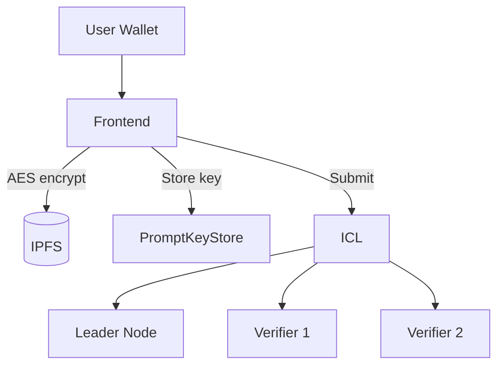

# Components Showcase

This page demonstrates all the Mintlify components available for writing Blindference documentation. Use these patterns to keep docs consistent, readable, and visually engaging.

---

## Callouts

Use callouts to highlight important information. We use four types across the docs.

### Note

Use `<Note>` for supplementary information that adds context without urgency.

<Note>
  The ICL cannot decrypt any data — it only coordinates tasks between nodes and the blockchain.
</Note>

### Tip

Use `<Tip>` for helpful hints, best practices, or shortcuts.

<Tip>
  Set `BLF_LOG_LEVEL=DEBUG` when troubleshooting node behavior. You'll see full CoFHE operation logs.
</Tip>

### Warning

Use `<Warning>` for cautionary information that could cause issues if ignored.

<Warning>
  Tier 0 (mock) attestation provides **no trust guarantee**. It is for development and testing only. Production nodes must use TPM or TEE tiers.
</Warning>

### Info

Use `<Info>` for neutral background information or definitions.

<Info>
  The default quorum topology is **1 leader + 2 verifiers**. This can be adjusted via the ICL configuration.
</Info>

---

## Cards & Card Groups

Use cards for navigation, feature lists, or summarizing options.

### Single Card

<Card title="Run a Node" icon="server" href="compute/quickstart">
  Start earning fees by executing encrypted inference jobs. GPU optional.
</Card>

### Card Group

<CardGroup cols={2}>
  <Card title="Compute Providers" icon="cpu" href="compute/introduction">
    Run a Blindference node to earn fees executing encrypted inference jobs.
  </Card>
  <Card title="Agent Developers" icon="code" href="build/introduction">
    Build agents that use Blindference for confidential inference and AI workflows.
  </Card>
</CardGroup>

---

## Steps

Use `<Steps>` for procedural guides where order matters. Each step gets an icon and optional title.

<Steps>
  <Step title="Install" icon="download">
    Install the node runtime via PyPI:
    ```bash title="Install via pip"
    pip install blindference-node
    ```
  </Step>
  <Step title="Initialize" icon="settings">
    Run the interactive setup wizard:
    ```bash title="Initialize node"
    blindference-node init
    ```
  </Step>
  <Step title="Attest" icon="shield">
    Register with the ICL:
    ```bash title="Attest node"
    blindference-node attest --mock
    ```
  </Step>
  <Step title="Run" icon="play">
    Start the daemon:
    ```bash title="Start daemon"
    blindference-node run
    ```
  </Step>
</Steps>

---

## Tabs

Use `<Tabs>` when users need to choose between alternative paths (e.g., OS, install method, configuration mode).

<Tabs>
  <Tab title="PyPI (Recommended)">
    ```bash title="Install from PyPI"
    pip install blindference-node
    ```
    Fastest path. No compilation needed.
  </Tab>
  <Tab title="From Source">
    ```bash title="Clone and install"
    git clone https://github.com/baync180705/Blindference-node.git
    cd Blindference-node
    pip install -e .
    ```
    For contributors or custom modifications.
  </Tab>
  <Tab title="Docker">
    ```bash title="Run with Docker"
    docker build -t blindference-node .
    docker run -e BLF_KEY_PASSWORD=secure_password blindference-node run
    ```
    For containerized deployments.
  </Tab>
</Tabs>

---

## Accordion

Use `<Accordion>` for FAQ items, collapsible details, or dense reference content.

<Accordion title="What happens if my node misses heartbeats?">
  If your node misses heartbeats within the grace period (300 seconds), it is temporarily removed from the active pool. No reputation penalty is applied if the node recovers within the grace period. After recovery, the node re-enters the active pool on the next successful heartbeat.
</Accordion>

<Accordion title="Can I run multiple nodes on the same machine?">
  Yes. Use different config directories and wallets:
  ```bash title="Multiple nodes on one machine"
  export BLF_CONFIG_PATH=/tmp/node1/config.json
  blindference-node init && blindference-node run
  ```
</Accordion>

<Accordion title="How do I switch from Bridge to Python CoFHE mode?">
  Set the environment variable before running:
  ```bash title="Switch CoFHE mode"
  export BLF_COFHE_MODE=python
  blindference-node run
  ```
</Accordion>

---

## Code Blocks with Titles

Always add a `title` attribute to code blocks. It shows the filename or context.

```typescript title="SDK Configuration"
const client = await cofheClient.create({
  provider: window.ethereum,
  signer: walletClient,
  fheKeyStorage: null,
  useWorkers: false
});
```

```python title="Risk Model Evaluation"
def evaluate_risk(credit_score: int, loan_amount: int) -> int:
    credit_factor = max(0, (850 - credit_score) / 850 * 40)
    amount_factor = min(20, loan_amount / 50000 * 20)
    return int(credit_factor + amount_factor)
```

```bash title="Check Node Status"
blindference-node status
```

---

## Tables

Use tables for structured reference data. Keep column headers concise.

| Tier | Name | Hardware | Trust Level | Job Eligibility |
|------|------|----------|-------------|-----------------|
| 0 | Mock | None | Development | Verifier + Leader |
| 1 | TPM 2.0 | TPM chip | OS-level | Verifier + Leader |
| 2 | TEE/SGX | Intel SGX | Memory encryption | Verifier + Leader |

---

## Mermaid Diagrams

Use Mermaid for architecture and flow diagrams. Keep them simple and label every node.



---

## Best Practices

<Tip>
  **Order of preference**: Use `<Steps>` for procedures → `<Tabs>` for alternatives → `<Accordion>` for collapsible details → `<CardGroup>` for navigation.
</Tip>

<Tip>
  **Always add `title` to code blocks**. It helps readers understand context at a glance.
</Tip>

<Tip>
  **Use `<Warning>` sparingly**. Too many warnings create alert fatigue. Reserve for truly critical cautions.
</Tip>

---

*See the [Mintlify Documentation](https://mintlify.com/docs) for the full component reference.*
