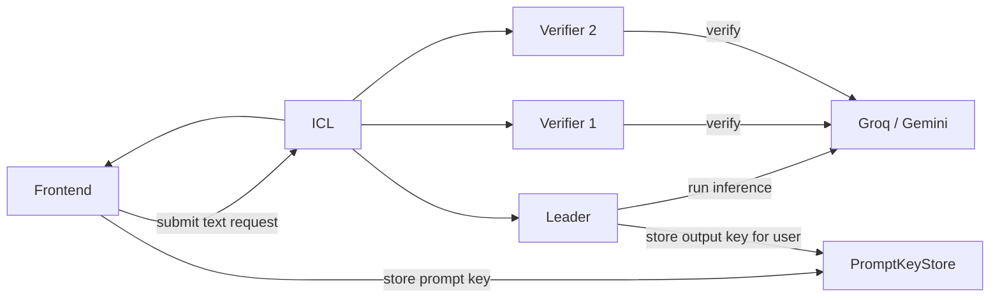

# Wave 3 Monorepo Notes

This is the active Blindference monorepo for the Wave 3 build.

## What This Monorepo Covers

The current Wave 3 build contains both of the currently implemented product surfaces:

- confidential risk scoring
- confidential text inference

The text pipeline is the major expansion in this Wave 3 build and adds:

- browser AES prompt encryption
- prompt/output blob storage through Pinata/IPFS
- on-chain prompt/output key handling through `PromptKeyStore`
- Groq / Gemini text inference
- frontend result reveal for the user

## Package Map

```text
wave2_network/
├── packages/contracts/           Core contracts including PromptKeyStore
├── packages/blindference-demo/   Demo-specific contracts still used by the UI shell
├── packages/icl/                 FastAPI coordination backend
├── packages/frontend/            Active React/Vite frontend
├── packages/node-reineira/       Leader / verifier runtime
├── packages/shared/              Shared TypeScript helpers
├── packages/shared-py/           Shared Python helpers
├── packages/fhe-mocks/           Optional local mock FHE package
├── protocol/                     Reineira upstream reference code
└── scripts/demo/                 Start/stop/status helpers
```

## Recommended Demo Run

Start everything:

```bash
bash wave2_network/scripts/demo/run-stack.sh
```

Check status:

```bash
bash wave2_network/scripts/demo/status.sh
```

Stop everything:

```bash
bash wave2_network/scripts/demo/stop.sh
```

Open:

- `http://127.0.0.1:3000`

## What The Demo Scripts Do

The stack scripts launch:

- ICL
- leader node runtime
- verifier 1 node runtime
- verifier 2 node runtime
- frontend dev server

Logs:

```text
wave2_network/scripts/demo/logs/
```

PID files:

```text
wave2_network/scripts/demo/pids/
```

## Text Demo Path



## Install By Package

### Contracts

```bash
cd wave2_network/packages/contracts
forge build
forge test -vv
```

### Demo contracts

```bash
cd wave2_network/packages/blindference-demo
forge build
forge test -vv
```

### ICL

```bash
cd wave2_network/packages/icl
python -m venv .venv
source .venv/bin/activate
pip install -r requirements.txt
cp .env.example .env
```

### Frontend

```bash
cd wave2_network/packages/frontend
npm install --legacy-peer-deps
cp .env.example .env
```

### Node runtime

```bash
cd wave2_network/packages/node-reineira
source ../icl/.venv/bin/activate
pip install -r requirements.txt
npm install --legacy-peer-deps
cp .env.example .env
```

## Runtime Configuration Notes

### Frontend

Important values:

- `VITE_ICL_API_URL`
- `VITE_PROMPT_KEY_STORE_ADDRESS`
- `VITE_TEXT_MODEL_DEFAULT`
- `VITE_IPFS_GATEWAY_URL`

### ICL

Important values:

- `ARBITRUM_SEPOLIA_RPC`
- `COFHE_RPC_URL`
- `PROMPT_KEY_STORE_ADDRESS`
- `ICL_PRIVATE_KEY`
- `DEMO_OPERATOR_PRIVATE_KEYS`
- `PINATA_JWT`

### Node runtime

Important values:

- `BLINDFERENCE_NODE_ICL_BASE_URL`
- `BLINDFERENCE_NODE_PROVIDER`
- `BLINDFERENCE_NODE_GROQ_API_KEY` or `BLINDFERENCE_NODE_GEMINI_API_KEY`
- `BLINDFERENCE_NODE_PROMPT_KEY_STORE_ADDRESS`
- `BLINDFERENCE_NODE_OPERATOR_PRIVATE_KEY`
- `PINATA_JWT`

## Fresh Text Validation

When validating text mode, always use a fresh request after restart.

Why:

- the latest fixes changed how prompt/output key handles are persisted
- older failed jobs may still point at stale handles and give misleading results

Suggested logs to watch:

```bash
tail -f wave2_network/scripts/demo/logs/icl.log
tail -f wave2_network/scripts/demo/logs/node-leader.log
tail -f wave2_network/scripts/demo/logs/node-verifier1.log
tail -f wave2_network/scripts/demo/logs/node-verifier2.log
```

## Naming Note

The folder is still called `wave2_network/` because that was the established repo layout. The docs and deployment story should treat this as the Wave 3 build.
